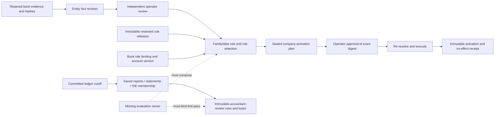

# Company profile and evaluation-contract grounding

Read-only source trace on 2026-10-01 at frozen baseline `/Users/admin/.codex/worktrees/whole-year-baseline/openERP`, revision `72db7fb402dce258204c4d79797664bd01e09747`. The reported-facts update below reads maintained D-04 at later baseline HEAD `c6bd75af3b8ef99c8907640818881e2a2b9c1169`; the earlier source trace was not re-executed or requalified at that revision. This report is the only written artifact. No checks, runtime probes, credentials, original company records or providers were used. Findings describe source behavior, not verified runtime results. Requirements come from the supplied packet table and packet inventory; `docs/README.md`, `docs/open-decisions.md` D-03/D-04 and `docs/plans/10-external-inputs.md` retain their authority.

## Overview

Reuse `application/company-profiles.ts` for effective-dated company facts and admission. Reuse report, accountant-review and SIE owners for saved result membership and bytes. No existing owner implements a shared evaluation contract, assistance ledger, first-pass freeze or accountant-reference withholding. Those responsibilities require an explicitly named application owner that composes these existing owners; a second company-profile or accounting engine would duplicate authority.

The owner has supplied reported Drastic AB facts, retained below. Original-source admission, reviewed effective history and runtime activation remain unestablished. A synthetic release or fixture is engineering evidence only and cannot establish or activate a real company profile.

## Reported Drastic AB facts and remaining admission gates

The owner's 2026-10-01 report changes what is reported, not the state of application admission. Preserve these distinct claims and dates:

| Reported claim | Date or coverage stated | What remains before actual admission |
| --- | --- | --- |
| Company registration | 2025-05-17 | Retained original registration evidence, identity matching and independent review. Do not substitute this for any VAT date. |
| Fiscal year, confirmed with Bolagsverket per owner | 1 May–30 April | Original fiscal-year record and actual first-period boundaries. D-04 retains an earlier reported first year 2025-05-17 → 2026-04-30; this update does not derive or activate that interval from registration. |
| VAT accounting method | Bokslutsmetoden, reported effective 2025-05-09 | Original method record, meaning and full effective history. Keep separate from bookkeeping method. |
| VAT reporting cadence | Annual, whole tax year, reported effective 2025-05-09 | Original period/cadence record and actual tax-year coverage. Annual cadence alone does not establish the first VAT reporting period. |
| F-tax registration | 2025-06-18 | Original registration and effective history; the traced fact-kind model has no F-tax-registration field. |
| VAT registration | 2025-06-18 | Original registration and effective history. Do not merge this date with 2025-05-09 or assert registration before 2025-06-18. |
| Employer registration | Reported not registered; no effective date supplied | Original record/history and dated applicability. Do not invent an effective-from date or infer absence of every payroll-related source. |
| Bookkeeping method | Cash indicated; confirmation still required | Explicit method confirmation and retained evidence. VAT bokslutsmetoden does not settle the independent accounting-method fact. |
| Reporting framework | K2/K3 unknown | Actual eligibility, chosen framework and period-applicable reviewed release. The implemented K2 target does not settle this company fact. |

Prior declarations, complete source/account population, prior official ledger and asset/FX/payroll cases remain unestablished. The ordering 2025-05-09, 2025-05-17 and 2025-06-18 is retained as reported; neither this report nor a synthetic fixture resolves the relationship between those records. Unknown affected facts continue to block their actual financial actions while retention, review and isolated synthetic proof can proceed.

## Traced model

Paths below are relative to the frozen baseline. Line anchors name source entry points.

| Responsibility | Actual owner and behavior | Limit |
| --- | --- | --- |
| Facts | `application/company-profiles.ts:200` `recordCompanyFact`, contracts `company-profiles.ts:23`, DB `company-profiles.ts:108`. Immutable entity-scoped revision, effective interval, optional same-kind `supersedesId`, retained evidence IDs/hashes, actor, time, digest and replay receipt. Values distinguish known, unknown and not applicable. | Fact kinds are jurisdiction, legal form, organization number, accounting method, VAT registration/cadence, fiscal year and payroll registration. No independent VAT-method, reporting-framework eligibility or transaction-population fact. |
| Review | `company-profiles.ts:341` `reviewCompanyFact`. Exact expected revision digest, independent recorder/reviewer, one immutable confirmed/rejected review per revision. | Review establishes that revision only. Not-applicable still fails the selector's known-value requirement; it does not prove a family exemption. |
| Role bindings | `company-profiles.ts:434` `recordCompanyRoleBinding`, `company-profile-basis.ts:385` `activeRoleBindings`. Book-scoped evidence and effective dates; selection requires exactly one binding and its active account's exact version. | The request supplies a reviewer identity different from the recorder; this is not a separate authenticated role-review workflow. |
| Selection | `company-profile-basis.ts:41` `familySelector`, `:161` `selectWitness`, `:280` `qualifies`. Posting uses posting date; VAT tax point; payroll payment date; statements report date; corporate tax fiscal tax-period date. Missing dates refuse that family. | Selectors concern one date, not complete fiscal-year/population coverage. Legal AR is separately owned by `commerce.legalProfile.activate`. |
| Releases | `contracts/company-profiles.ts:432` `RuleRelease`, `db/company-profiles.ts:167` read. Reviewed status, jurisdiction/family, validity interval, record class, applicability restrictions, required facts/roles, calculator/rounding and source manifest. Payroll/VAT/corporate-tax content stays in this release authority. | Application owner reads releases; no publish/qualify release-intake capability was found. Runtime gets SELECT only (`migrations/0004-next-02.sql:169`). A source manifest string does not prove primary-source qualification. |
| Book activation | `company-profiles.ts:557` prepare, `:687` approve, `:770` execute. Plan seals exact witness and family epoch. Execution re-resolves current facts/reviews/roles/release, locks plan/membership, checks exact digest and current unexpired/unrevoked operator approval, requires executor different from approver. | Activation selects a single witness; the supplied activation effective interval is not independently shown to have continuous fact/release coverage. |
| Receipt/replay | `posting.ts:376` replay and `:425` save; `company-profiles.ts:886` activation receipt. Exact operation/actor/input digest under book/idempotency key; exact retry returns retained result, changed request conflicts. Commit records activation, consumed approval, immutable group receipt and command receipt atomically; no journal is created. | Source trace only: response-loss/concurrent replay not exercised here. |
| Historical change | `company-profiles.ts:297` `recordImpacts`. Supersession preserves prior activation and records affected activation IDs and whether already in force. | No successor activation or complete downstream correction workflow is established by this trace. |

An activated book pins its reviewed release before global candidate selection. Without activation, exactly one qualified global release is required; ambiguity refuses admission. Selection requires exactly one independently confirmed known revision for each required fact. The witness retains fact/review IDs, role IDs, rule ID/checksum, family dates and activation ID. `application/capabilities/company-profiles.ts` binds the public capabilities to these functions; mutation functions request operator-only admission through `commerce/support.ts:31`.

## Reusable result owners

- `application/reports.ts:136` saves a trial balance's committed sequence and date interval plus retained account lines; report families reuse its cutoff (`:713`). It currently admits only `synthetic-core-v1`. Journal explanations and general-ledger pages use that retained cutoff. This is arithmetic scope, not source completeness.
- `application/accountant-review.ts:821` captures an up-to-date source report, ledger/evidence/owner/control rows and provider dependencies under the admitted transaction. It seals basis/rows/pack digests and persists exact UTF-8 JSON/CSV bytes with SHA-256. `:1062` rereads saved packs and reports current dependency status without rewriting saved results. Capture has explicit bounds, including 1,000 vouchers/5,000 journal lines/1,000 evidence records/2 MiB evidence; overflow refuses. `accountant-review-providers.ts:20` supplies owner, expense, VAT, subledger, bank, commerce and schedule dependencies.
- The pack deliberately retains `companyCompleteness: not_established`, `statutoryReady: false` and unverified opening basis (`contracts/accountant-review.ts:230`). Its coverage explicitly says company profile missing. `accountantNotes` and excluded-source reasons are not a structured intervention record.
- `application/sie4e.ts:430` retains fiscal year, as-of date, committed ledger boundary, original dimension membership, source digest, renderer release and no-effect replay receipt. `application/sie/book-export.ts` likewise captures immutable review-pack transaction source and retained render artifacts. These are export owners, not evaluation barriers.
- `application/report-statements.ts:341` and `reports/annual-report.ts:183` own statement snapshots and annual-report drafts/approval/finalization. The annual owner requires a retained close certificate and matching snapshots but accepts a caller-selected supported K2 release (`:332`); it does not derive eligibility from company-profile facts. It remains synthetic/native/SEK scoped.
- SQL immutable guards protect facts, reviews, bindings, releases and activations (`0004-next-02.sql:160`), reports/review rows/artifacts, change sets, command receipts and posting receipts (`0002-integrity.sql:429`, `:471`, `:482`, `:585`, `:595`). Existing immutable records are useful constituents, not proof of a complete year pack.

## Exact gaps and ownership consequence

1. **Company input completeness:** add no assumed facts. Separate effective VAT method, F-tax registration where consumed, framework eligibility/version applicability, fiscal-period coverage and applicable transaction families need owned, reviewed representations. The reported facts above narrow requested inputs but do not fill the admission model or establish effective history. Existing bank inventories and subledger registers contribute coverage but cannot stand for an entire company population.
2. **Synthetic isolation:** `recordClass` appears on resolution/witness/plan/release, but fact revisions and committed activation contracts have no record-class field. Thus release filtering is not by itself a demonstrated synthetic-fact barrier. Use isolated synthetic entities/books now; require a proof that synthetic facts cannot satisfy actual-company admission before real activation.
3. **Activation preparation mismatch:** the body built in `company-profiles.ts:625` omits `createdBy` and `createdAt`, both required by `CompanyActivationPlan` (`contracts/company-profiles.ts:346`). `versionedDigest` hashes only; it does not add fields (`application/json.ts:44`). The subsequent decoder appears to reject preparation. This is a source-backed concern, untested here.
4. **Correction selection:** DB interval reads and `confirmFacts` (`company-profile-basis.ts:336`) do not remove superseded revisions. Selection therefore appears to report ambiguity for two overlapping confirmed revisions even when one supersedes the other. Existing impact records preserve history, but no complete replacement/admission path was found. This is a source inference, not an executed failure. It needs an explicit correction contract, not an assumption that newest wins.
5. **Shared evaluation inputs:** no retained evaluation identity binds selected facts, original-source inventory, opening basis, period/family population, rules, actor/tool permissions and the inputs given to both agent and accountant. Company profiles should remain fact authority; a new named evaluation application owner should reference their immutable witnesses and existing retained source IDs.
6. **Human assistance:** no intervention owner records who intervened, time/order, reason, permitted assistance class, supplied information, affected records and whether before/after first-pass freeze. Existing evidence notes, reviews, approvals and accountant notes cannot prove the evaluation's allowed-assistance boundary.
7. **Freeze/reference barrier:** no state transition records an immutable first-pass manifest and receipt or prevents reference exposure until that transition. Book-level source access (`source-retention.ts:556`, `sie/import.ts:158`) has no evaluation-phase check. A reference stored in the agent-readable candidate book could therefore leak through existing reads. Separate custody must precede reference upload; later comparison must reference the sealed first pass rather than overwrite it.
8. **Comparison and complete pack:** generic SIE preview/import and snapshot arithmetic comparison are not a separate accountant-reference dataset or economic comparison owner. Full family coverage, readable complete year pack, reviewed successor version and correction lineage remain packet 18–20 obligations.

## Future proof obligations, specified before implementation/results

These are acceptance obligations, not tests executed in this report. Write independent fixture manifests and expected results before examining production output. Exercise ordinary HTTP/MCP/operator boundaries against disposable systems; retain request/response receipts, source/revision/migration identity, artifact bytes and independently recomputed hashes.

| Scenario | Independently specified expected observation |
| --- | --- |
| Unknown/unsupported facts | Missing VAT method, framework eligibility or required family population stays explicit; affected real action refuses with no activation/voucher/receipt claiming success. Synthetic default never changes actual-company readiness. Unaffected retention/review remains possible. |
| Effective history | Fixture method/registration change on a fixed date resolves old/new facts on either side; boundary day follows declared inclusivity. Missing dates and confirmed overlapping facts refuse; no date uses today's rule as a substitute. A year spanning a change requires all slices covered. |
| Qualification and activation | Unreviewed/rejected facts, wrong record class/jurisdiction, absent/ambiguous/withdrawn release, stale account version and missing roles refuse. Valid fixture preparation returns all required actor/time fields; exact approved plan activates once and creates zero journals. |
| Activation sealed-body failure vector | First create a fully resolved synthetic witness through ordinary owners, then prepare an activation with a fresh idempotency key. Independently expect a schema-valid plan containing authenticated `createdBy` and database `createdAt`, both bound into its digest. If preparation returns a schema/internal failure, retain that authentic response and independently read back absence of a committed partial plan, membership change or successful command receipt; do not relabel the failure a pass. |
| Supersession selection failure vector | Before execution, specify fact A confirmed for 2026-01-01 onward and fact B confirmed for the same dates with `supersedesId: A`. Resolve on 2026-02-01. The traced implementation predicts `ambiguous_fact`, no witness and no new activation. Observe this through the ordinary boundary, retaining both revisions/reviews and the response. A later adopted correction contract must separately specify how one replacement becomes effective while preserving A; no test may silently assume B wins. |
| Authority and staleness | Recorder cannot review own fact; executor cannot use own approval. Changed fact/binding/account/family epoch, expired/revoked approval or removed approver authority prevents execution. Historical activation and receipt bytes remain unchanged. |
| Correction | Supersession creates an explicit impact and preserves old proof; the declared correction policy either resolves one reviewed replacement or refuses ambiguity. Successor report/evaluation references old versions and never silently edits first-pass bytes. |
| Response loss/race | Drop first successful activation/freeze response, retry exact key, and run two concurrent identical requests: one committed effect and same receipt. Reusing key with different actor/input conflicts. Rollback leaves no partial activation/freeze or consumed approval. |
| Shared inputs and assistance | Agent and accountant manifests name identical permitted original inputs and reviewed fact/rule versions. Each allowed intervention appends a retained record with actor/class/time/content/source linkage. A forbidden intervention refuses or explicitly disqualifies evaluation; it cannot disappear into notes. |
| Withholding | Before freeze, candidate agent cannot list, search, retrieve bytes/metadata, preview SIE, read context or export accountant reference through any allowed boundary. Direct ID, pagination and restart attempts also refuse. Reference upload cannot contaminate candidate evidence/context. Freeze receipt predates first successful disclosure. |
| Immutable first pass | Freeze binds fixed ledger cutoff, report/export IDs, exact artifact hashes, profile/rule/input manifest and intervention boundary. Post-freeze posting, source supersession and reference disclosure leave first-pass bytes unchanged; reviewed output is a separately identified successor. Interrupted freeze is either wholly absent or recoverable via exact receipt. |
| Independent arithmetic and representation | Before implementation, fixture specifies opening bank debit 100,000 minor units, capital credit 100,000; one reviewed expense debit 10,000 and bank credit 10,000, no VAT. Expected bank closing debit 90,000, expense debit 10,000, capital credit 100,000. Accountant grouping/numbering may differ but economic comparison is equal. Omitting expense produces a 10,000 bank and expense difference with both source lineages; numbering-only differences do not become accounting errors. This bounded vector does not prove whole-year completeness. |
| Complete recovery artifact | Restore/restart discovers evaluation identity, original inputs, interventions, freeze receipt, exact artifacts and comparison lineage. Artifact manifest independently validates declared coverage and hashes; an overflow or missing family prevents complete status. |

## Precise synthetic cash-profile obligations

These obligations cover the indicated cash path without settling Drastic AB's bookkeeping method or K2/K3 choice. They are independently specified fixture requirements, not executed results or qualified Swedish legal conclusions. Rule releases must be qualified for the fixture's declared period before their executable expectations are adopted.

1. Use disposable, separately named synthetic entities/books, `recordClass: synthetic`, synthetic original evidence and explicit reviewed releases. Retain an accrual control fixture and a cash fixture. Declare accounting method and VAT method independently; represent their required distinction explicitly rather than inferring one from the other. The absent VAT-method representation remains an implementation prerequisite.
2. Give the primary cash arithmetic fixture an explicit synthetic period, 2026-01-01 → 2026-12-31, and annual whole-tax-year VAT cadence. This period is chosen solely for engineering and makes no claim about Drastic AB's first fiscal or tax period. Declare synthetic AB/SEK, tax registrations, account-role mapping, opening basis and supported transaction-family population, including reviewed exclusions. Do not copy reported company identity into it.
3. Retain a separate date-selection fixture with method/cadence effective 2025-05-09, company-registration evidence dated 2025-05-17 and VAT/F-tax registration effective 2025-06-18. Label every row synthetic. Before results, require method/cadence date preservation and registration-dependent refusal before 2025-06-18; do not infer an actual first period or fill employer-registration dates. This fixture tests distinctions among supplied dates, not their real-world validity.
4. Declare the arithmetic rule fixture explicitly: supported cash documents create no expense/revenue/VAT recognition merely on issue; effective partial payments recognise proportionate amounts; declared unpaid year-end treatment recognises only the remaining amounts; later settlement clears year-end payable/receivable without repeating expense/revenue/VAT. The application must derive capacities from retained documents/payments inside its owning transaction.
5. Supplier vector: gross 12,500 minor units, expense 10,000, input VAT 2,500; a 5,000 effective partial payment produces expense 4,000 and input VAT 1,000 with bank credit 5,000. At the declared year-end, the unpaid 7,500 produces expense 6,000 and input VAT 1,500 against payable 7,500. Later payment produces payable debit 7,500/bank credit 7,500, with zero further expense/VAT. These exact totals are fixture expectations fixed before production output.
6. Customer vector: gross 25,000 minor units, revenue 20,000, output VAT 5,000; a 10,000 effective partial receipt produces bank debit 10,000/revenue credit 8,000/output VAT credit 2,000. At the declared year-end, unpaid 15,000 produces receivable debit 15,000/revenue credit 12,000/output VAT credit 3,000. Later receipt produces bank debit 15,000/receivable credit 15,000, with zero further revenue/VAT.
7. Test full unpaid-population enumeration, exact rounding for a separate indivisible partial-payment case, credit/refund/reversal before and after year-end recognition, payment in a locked/out-of-period interval, stale review/source/authority, concurrent duplicate recognition and lost-response replay. Independently specify rounding and reversal vectors before execution; never let the implementation calculate its expected oracle. A missing unsupported family blocks complete status rather than being silently excluded.
8. Keep annual VAT basis tied to the explicitly declared fixture tax year, retained tax-point/method history and qualified release. Refuse missing coverage, contradictory effective facts and registration-dependent work lacking admission. Show the above supplier/customer amounts exactly once across initial cash recognition, year-end and subsequent settlement.
9. Make framework-unknown a negative fixture: preserve arithmetic/control outputs but refuse framework-dependent statutory completion. A separate explicit synthetic eligible-K2 fixture may exercise the existing annual-report owner against a period-qualified release; it provides no Drastic AB eligibility evidence and does not claim K3 support.
10. Retain a repeatable E2E artifact naming fixture inputs, independently fixed expected ledger/VAT/owner balances, actual ordinary-owner requests and receipts, refusal/correction/recovery outcomes, revision/migrations, fixed-cutoff report/export bytes and their independently checked hashes. Freeze that first-pass artifact before reference disclosure and retain later reviewed versions separately. Passing a cash calculation alone cannot close packet 2, 13 or the whole-year evaluation.

No implementation design is activated by this report. Packet 2 remains incomplete until the missing contract owner is decided, wired and proven through repeatable artifacts; real-company activation additionally requires evidenced actual facts.
