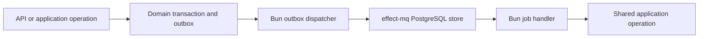

# 0009 — effect-mq background jobs on Bun and PostgreSQL

Status: accepted design, 2026-09-25, selected by the user. The first queue adapter and Bun runner are implemented; synthetic end-to-end proof passed, while failure-matrix and deployment proof remain open.

## Context

The [application-owned accounting plan](../plans/application-owned-accounting.md) moves workflows into Effect application operations. Preparation previously used Cloudflare Workflows and a Cron dispatcher. Implementing generic queue claims, retries, scheduling and attempt history ourselves would duplicate an existing Effect-native library.

Source inspection found that effect-mq uses our Drizzle Effect driver family and compatible declared Effect 4 peer ranges. Its persistent worker and PostgreSQL listener fit a Bun process. A regular API Worker invocation does not own that process lifetime. The installed package is `0.7.0` at source revision `b5898fbae56fe926c28768a5a8ff9ad74f1e57a0`; its store started against our pinned dependencies on disposable PostgreSQL 17.

## Decision

Use effect-mq's PostgreSQL store and a persistent Bun background process for hosted and self-host installations. Keep the existing API runtime choices. The Bun process uses the same application operations and domain packages as the API; it is another runtime composition of the application.

The runner owns a bounded PostgreSQL pool supporting the library's notification listener and polling recovery. Its connection path must preserve listener sessions. API Worker connections continue through Hyperdrive, with no queue listener or background worker layer loaded into request scope. Hosted placement and credentials remain deployment inputs under D-07.

Use the application outbox to cross the financial transaction boundary:

The domain mutation and outbox row commit together. The dispatcher enqueues a deterministic job derived from the outbox event, then records dispatch acknowledgment. A crash after enqueue can cause another enqueue; handlers converge on the same durable domain identity even after queue history is pruned. Do not assume library enqueue participates in an application transaction without proof. The library's internal parent/child flow outbox has a different owner and purpose.

Job payloads carry scoped record/revision references and stable operation identity, not access tokens. Handlers establish their service authority, recheck current book permissions and relevant domain run/cancellation versions, then call a named application operation. A queued request cannot mint human approval or replace the approved effect. Job locks fence queue ownership; domain version checks and receipts fence business effects when a stale handler is still running.

effect-mq owns scheduling, queue claims, heartbeats, retries and attempt history. Domain code owns business progress, financial idempotency, current authority, approval, receipts and correction. Cancellation stops pending work; an already committed financial effect requires its ordinary correction workflow. External deliveries use their own stable provider identity and recovery behavior where available; queue retries do not establish exactly-once external effects.

Add the pinned library table layout to the existing reviewed SQL setup and typed mappings. Use the library's schema factories, verify their agreement with DDL, and keep one migration ledger. Mutate queue records through the store API. Scope job reads and administration in application operations; do not expose a raw store administration endpoint.

Use concrete job definitions calling application functions. Do not build a generic adapter layer supporting several queue products. Replace the Cloudflare preparation Workflow and its Cron dispatcher once the new flow is complete. Remove generic queue bookkeeping that duplicates effect-mq, while preserving business records with independent meaning.

## Alternatives

| Alternative | Reason for this decision |
| --- | --- |
| Cloudflare Queues and Workflows | Managed operation is attractive, but the selected design prefers Effect-native job definitions and the same PostgreSQL/Bun execution model for hosted and self-host installations. |
| Handwritten PostgreSQL job runtime | Reimplements claims, retries, schedules, stalled recovery and history that the selected library supplies. |
| Run effect-mq inside ordinary API Worker requests | Does not match its continuous worker/listener lifetime; would require a different runtime integration to prove. |

## Implementation and proof

The first adapter uses the existing committed `preparation_jobs` row as durable dispatch intent. The queue identity includes job ID and checkpoint; dispatch rediscovers ready records after an enqueue/ack crash. The handler still invokes the pre-cutover SQL preparation operation until that application slice moves. A dedicated application outbox row and hosted process deployment remain open. The new queue DDL applied on disposable PostgreSQL 17 and the runner started a bounded listener pool under a non-owner login. With the concurrently staged FX syntax fix, the full legacy chain through `9300-effect-mq.sql` applied on a fresh disposable database; that fix must land before a clean install is available from this branch alone. Synthetic API admission, queue dispatch, one checkpoint, persisted completion, API recovery read and runner restart after admission all passed. That run selected zero observations and did not exercise financial posting. The local proof artifact is `test-results/e2e/preparation-queue-smoke.json`.

Required observations include rollback before admission; crashes before/after enqueue acknowledgment; duplicate delivery; kill/restart and lost claims; current-authority and cancellation changes; stale handlers; history pruning followed by replay; disconnected notification recovery; bounded connections; graceful shutdown; and backup/restore followed by pending-work rediscovery. Financial effects must remain unique and atomic throughout. Sanitize library errors, persisted exits and logs before allowing raw database causes or credentials to cross their boundary.

Use the existing failure-first E2E policy and retain repeatable artifacts. Test additions/edits require the repository's explicit authorization. A selected library or successful compile does not establish these runtime results.

This decision supersedes Cloudflare-specific background-runner choices for the planned replacement. It also supersedes the older plan sentence forbidding any `LISTEN/NOTIFY` dependency for the background runner: effect-mq's PostgreSQL store requires a session-preserving listener with polling recovery on its separate Bun process. It does not change the financial rule in [ADR 0010](0010-application-owned-accounting-replacement.md): financial transactions use no session-level tenant context and no advisory locks, and the API Worker does not load the listener. No hosted infrastructure was deployed or tests changed by the first adapter.

## Sources

- [Package and peer dependencies](https://github.com/TeamWarp/effect-mq/blob/b5898fbae56fe926c28768a5a8ff9ad74f1e57a0/packages/effect-mq/package.json).
- [PostgreSQL store implementation](https://github.com/TeamWarp/effect-mq/blob/b5898fbae56fe926c28768a5a8ff9ad74f1e57a0/packages/effect-mq/src/drizzle-postgres/DrizzleJobStore.ts).
- [Worker lifecycle and delivery](https://github.com/TeamWarp/effect-mq/blob/b5898fbae56fe926c28768a5a8ff9ad74f1e57a0/docs/guide/workers.md).
- [Current preparation adapter](../../apps/api/src/application/preparation-jobs.ts) and [Cloudflare runtime](../../apps/api/src/runtime/cloudflare.ts).
