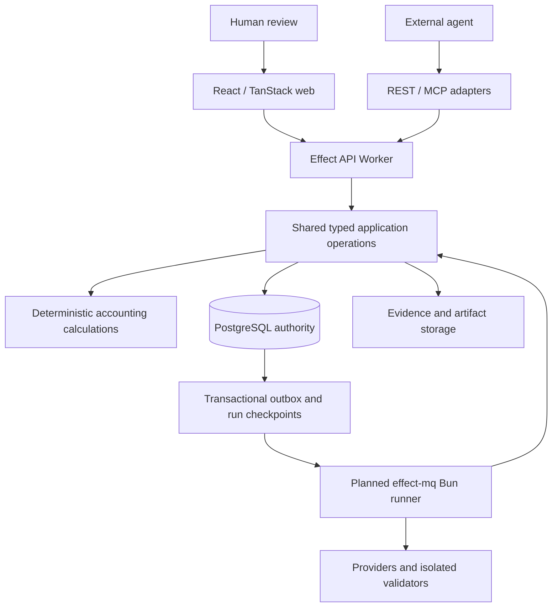

# Architecture and ownership

Status: existing ownership is established by [AGENTS.md](../AGENTS.md); accounting implementation is partial and the application-owned replacement is a working design. [ADR 0001](adr/0001-checkout-runtime-and-accounting-boundary.md) records the runtime baseline; [ADR 0004](adr/0004-complete-accounting-delivery-contract.md) records the financial delivery boundary; [ADR 0010](adr/0010-application-owned-accounting-replacement.md) records the selected ownership, clean baseline, caller cutover and no-compatibility decision.

## Repository ownership

This map defines ownership. The [planning baseline](plans/evidence/planning-baseline.json) is a dated source inventory; the [roadmap](roadmap.md) records evidence and remaining gates.

| Owner                | Observed responsibility                                                                                             |
| -------------------- | ------------------------------------------------------------------------------------------------------------------- |
| `apps/web`           | TanStack Start/Router, request-scoped TanStack Query, Paraglide and product composition.                            |
| `apps/api`           | Effect 4 Worker/Bun runtime, shared accounting operations, transaction-passing persistence, PostgreSQL integrity and runtime/maintenance adapters. |
| `packages/domain`    | Accounting values, exact-money schemas, ledger/book models and domain errors, without transport or runtime imports. |
| `packages/contracts` | Effect Schema API contracts composed from domain models; generated OpenAPI at `/api/openapi.json`.                  |
| `jurisdictions/se`   | Pure VAT draft calculation and SIE 4I rendering, using retained contract inputs.                                    |
| `packages/ui`        | Owned interface components, StyleX tokens and global styles.                                                        |
| `packages/config`    | Shared strict TypeScript configuration.                                                                             |
| `infra/alchemy`      | Web/API Worker deployment definition and service binding.                                                           |

The browser calls same-origin `/api/*`. Vite proxies it locally; the deployed web Worker forwards it through the API service binding. The web server has no accounting database connection. The API sets `Cache-Control: no-store`; database caching is configured separately.

## Target flow

The diagram is the selected complete architecture. Initial operations and persistence exist; object/archive, durable delivery, domain depth and provider coverage require the packet-specific implementation and proof in the [complete plan](plans/README.md).

PostgreSQL owns financial records, approvals, dependency revisions, receipts and durable business-run state. Object storage holds original bytes and generated artifacts referenced by immutable manifests. Read caches and analytics are rebuildable projections. No browser cache, queue, workflow engine or model maintains an alternative accounting balance.

Keep an Effect modular monolith. The [API layout](../apps/api/README.md) separates HTTP/MCP transports, application operations, database access, runtime configuration and adapters. Shared accounting models live in `packages/domain`; existing pure Swedish VAT and SIE calculations live in `jurisdictions/se`. The jurisdiction package imports captured input/output contracts as types and the shared domain error at runtime; it does not load HTTP handlers, SQL or provider clients. Layers compose dependencies at owning Worker or Bun runtime boundaries. [ADR 0007](adr/0007-domain-and-jurisdiction-layout.md) records this extraction; additional packages still need concrete responsibilities and callers.

[ADR 0005](adr/0005-open-accounting-and-managed-services.md) keeps the accounting, jurisdiction and agent layers open under AGPL-3.0-only, with optional managed operations outside the core. The [self-host package](../infra/self-host/README.md) composes the current API and prerendered UI using Bun and PostgreSQL. Rust/Wasm extraction remains deferred until a stable pure contract and a measured consumer justify it.

Effect owns scoped orchestration, domain preparation, authorization and application policy. Application operations own direct scoped writes and pass one transaction through all nested persistence. PostgreSQL owns relational records, DDL, constraints, grants, row locks, the narrow integrity layer and durable receipts; it does not own feature workflows through procedural functions. Drizzle's native Effect PostgreSQL adapter owns application queries, using request-local connections through `@effect/sql-pg` and `pg`. Typed Drizzle mappings serve direct application and maintenance queries; the three-file baseline owns the complete DDL and integrity definitions. The [shared contracts](plans/00-shared-contracts.md) define the lock order, identity, exact values and clean-baseline rules. A generic effect interpreter is not a prerequisite.

## Planned module boundaries

| Module                    | Owns                                                                                          | May not do                                               |
| ------------------------- | --------------------------------------------------------------------------------------------- | -------------------------------------------------------- |
| Evidence                  | Objects, import occurrences, asserted facts, source links and coverage.                       | Treat importing or matching as permission to post.       |
| Books                     | Entity/book profile, fiscal boundaries, accounts, posted journal, series and commit counters. | Allow alternative writers to bypass invariants.          |
| Accounting work           | Cases, treatment decisions, sealed changes, validation, approvals and runs.                   | Replace effects under an old approval.                   |
| Settlements and schedules | Open items, allocations, installments and their conserved amounts.                            | Post outside the shared transaction.                     |
| Rules and reporting       | Dated rules, TaxFacts, mappings, report snapshots and calculation lineage.                    | Calculate competing totals in the UI.                    |
| Obligations               | Filing versions, signing/submission state and receipts.                                       | Infer external success from local generation.            |
| Runtime adapters          | PostgreSQL, objects, delivery and external providers.                                         | Own independent business policy or financial identities. |

These are ownership boundaries, not independent deployments or tables to generate in advance.

## Runtime and resource constraints

Retain the installed Effect `4.0.0-rc.112` and its v4 API family. Retain Bun, Vite+, TanStack, StyleX, Paraglide and Alchemy. A framework upgrade is separate work. Bun is not the deployed Worker runtime; exercise the chosen database driver in local workerd before relying on it ([D-02](open-decisions.md)).

Each operation receives trusted actor/entity/book context. Connections and transactions have explicit scoped lifetimes and cleanup; mutable scope cannot live in a global singleton. A transaction uses one connection and transaction-local context. Immutable schemas and rules may be cached by version.

The authoritative Hyperdrive configuration disables query caching. API financial operations use explicit transactions with row locks and no session-level tenant context, advisory locks or `LISTEN/NOTIFY` dependency. The selected effect-mq Bun runner has a separate session-preserving PostgreSQL listener for queue delivery, with polling recovery; see [ADR 0009](adr/0009-effect-mq-background-jobs.md). The listener is not loaded in the API Worker and does not supply financial identity or state. Verify adapter support and cancellation against the selected runtime before relying on it. The [Cloudflare driver](https://developers.cloudflare.com/hyperdrive/examples/connect-to-postgres/) and [local development](https://developers.cloudflare.com/hyperdrive/configuration/local-development/) documentation are integration references, not proof that this checkout connects successfully.

Persist run checkpoints and outbox records in PostgreSQL. The current hosted preparation adapter uses Cloudflare Workflows and a Cron Trigger; the self-host task process is not connected yet. [ADR 0009](adr/0009-effect-mq-background-jobs.md) selects effect-mq on a persistent Bun worker to replace that background path in both installations. It consumes committed application-outbox work and calls shared application operations. effect-mq owns queue retries and leases; domain progress, current authority, cancellation versions and financial receipts remain application responsibilities. At-least-once delivery must converge through effect identities and receipts. See [Cloudflare delivery](operations/cloudflare.md) for the current implementation and the [replacement plan](plans/application-owned-accounting.md#selected-background-jobs-effect-mq) for the selected design and proof gates.

Native document validators belong behind a bounded process/container interface when needed. Deployment location, archive retention and restore are explicit decisions ([D-07](open-decisions.md)); an R2 setting alone is not a complete archival design.

## Delivery, projections and portability

Use relational records with immutable revisions and a transactional outbox. A general event-sourcing framework is not required. A delivery consumer records its `(consumer, event)` identity alongside local effects. Older events cannot overwrite a newer projection; projections expose their watermark and return not-ready or read the authority when they lag the requested snapshot. No correctness rule depends on global queue order.

Persist the selected input and result of each durable step. Cancellation stops unstarted work; undo of committed accounting effects is a separate correction. Keep database transactions free of model calls, provider requests, object downloads and rendering. Batch SQL work and bound concurrency by I/O family; measure per-book lock contention before introducing more complex locking or replicas. Final posting and readiness checks use authoritative state.

The self-host target composes the same operations with Bun, PostgreSQL, an archive store and a task process, with a validator process only where needed. Hosted operation retains explicit entity/book scope even when a single-company UI hides selectors. Tenant quotas and fair background scheduling prevent one company's import or model workload from exhausting shared capacity. These compositions require their own release evidence.

Native validators receive immutable artifacts, pinned schema/taxonomy bundles and bounded resource limits. Return input hashes, validator versions, structured diagnostics and a validation receipt. Keep process-global validator state isolated between jobs; a process boundary does not establish semantic correctness or replace the asset's usage terms.
