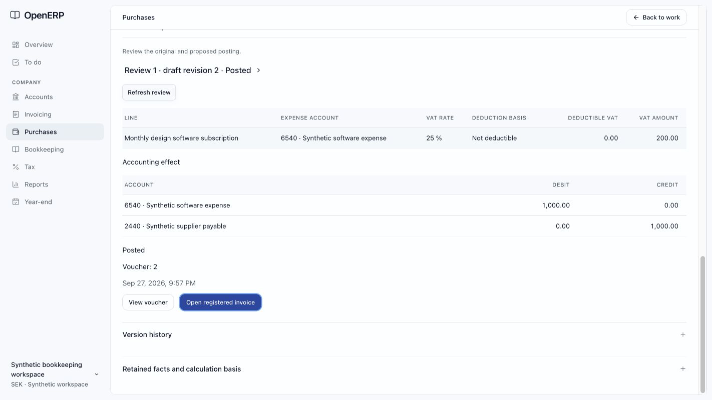
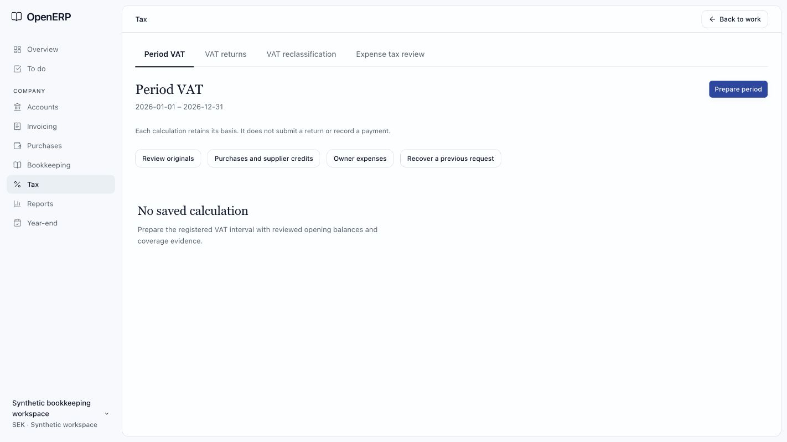

# Interface journey verification — 2026-09-27

The locally observed path connects the filtered work queue, retained original, supplier review, approval, posting receipt, exact voucher and return navigation. Period VAT now has an application screen backed by the actual-return owner. This is synthetic local evidence, not company qualification, a submitted return or payment verification.

## Environment and ownership

- Workspace: `/Users/admin/openERP`; integration HEAD at handoff: `d7d5ec568ba4312e4305e81e841ed5f5bdae904c`, with the uncommitted interface changes described below. Other work was occurring in this checkout; it was preserved. VAT producer work was integrated in the shared checkout during this task.
- Browser: Codex in-app browser, localhost:3000. Verification moved to a dedicated tab after the original tabs were navigated concurrently.
- API: local workerd on 8788; fresh PostgreSQL on 55479, database `interface_journey`, restricted application role, local R2 evidence bucket. No production data or remote posting was used.
- Scope: `entity_synthetic` / `book_synthetic`, `synthetic-core-v1`; accounting period `period_synthetic_2026`.
- Existing synthetic example plus synthetic receipt. Setup-only accounts 2440, 6540 and 2641 were added to the otherwise two-account example. Financial writes went through the application.
- No new test files or test cases were added by this task. The existing credit-document E2E file, including the concurrently developed VAT scenario, was executed unchanged by this task.

## Repeatable browser path and observations

Use the retained local synthetic workspace while its local services are running. A fresh setup requires the repository's documented provisioning steps; this document contains no credentials.

1. Open the work list, start a journal and retain evidence. Prepare a balanced 100 SEK entry (2999 debit, 1930 credit), open its exact review, acknowledge and approve it, reload, acknowledge and post it.
2. Filter the work list by `Interface journey`. The posted journal moves from open to completed. Open its receipt's **View voucher**, reload, then use **Back to review** and **Back to work**. The search/status context is restored.
3. In Purchases → Documents, upload the existing synthetic `receipt-demo.txt`, open the original and choose supplier preparation. Save `Interface journey · software receipt`, supplier number `SYN-JOURNEY-1`, net 800 SEK, source tax 200 SEK, total 1,000 SEK. Complete the invoice dates and reviewed account/tax inputs.
4. Prepare the synthetic supplier review with account 6540, payable 2440, 25% source tax and an explicit non-deductible treatment. The proposed expense remains 1,000 SEK and deductible VAT is zero.
5. On preparation or execution failure, **Retry exact request** recovers the original command identity. The repaired preparation succeeded; approval survived reload; posting committed voucher 2. The posted draft remained readable and its edit action disappeared.
6. From Completed work, open **Supplier invoice: Interface journey · software receipt**. It opens the supplier-owned review, not generic journal approval. **View voucher** → reload → **Back to review** → **Back to work** preserves search, completed status and period.
7. Choose the 2026 accounting period, apply filters, and open **Review period VAT and reconciliation**. The VAT inventory retains the chosen interval and explicit empty state. **Prepare period** starts with that interval, leaves opening balances unspecified and all coverage states unknown. The copy requires the registered VAT interval to be reviewed separately.
8. From the VAT screen, **Owner expenses** → **Back to work** restores the same filtered period queue. Source, purchase and recovery links carry the same context.

Retained identities:

| Record | Identity |
| --- | --- |
| Journal plan | `change_03cc004be8db4269a1edac902afcb06b` |
| Journal revision | `sha256:ef7cd90b17960f275a8e7587aae5e932f28b8106acfdd48ee3caae533e0bf737` |
| Journal voucher | `voucher_4010ba937ce14749aa5ad5a26394795e` |
| Retained receipt | `source_40916681bee340b8bba305a54e919493` |
| Supplier draft | `supplier_invoice_draft_ad6ee3f0283944d982ca8ccce07f4c60` |
| Supplier review | `supplier_review_479b9b099b9849d6a3323f2b405bec5a` |
| Supplier voucher | `voucher_5336ca6009b74f77aa81236c46545c3e` |
| Registered payable | `invoice_781ab8626d494e09b0f62c7c6d8fa09c` |

## Changes by root cause

### Continuity and truthful state

| Severity | Location | Before | After | Why |
| --- | --- | --- | --- | --- |
| HIGH, repaired | `apps/web/src/lib/work-return.ts:35`; `apps/web/src/lib/attention.ts:50`; review/books/tax/tools route search schemas | Empty queues lost return context; cursor and prepared selection were dropped; supplier plans opened generic review | Validated queue context is carried through record, original, review, voucher and period screens; supplier plans use their owner | Continuity: return to the same work and the correct approval authority |
| HIGH, repaired | `apps/web/src/components/commerce/supplier-acceptance.tsx:128`; `apps/api/src/application/purchases/drafts.ts:370` | Review selection was local; accepted drafts could no longer be read | Review is addressable, posted receipt is rediscovered and sealed drafts remain readable | Saved state must survive reload; a completed operation must lead to its result |
| HIGH, repaired | `apps/api/src/application/source-retention.ts:625`; purchases inbox/drafts/acceptance owners | Optional archive filters were required; inbox queried a nonexistent field; totals had the wrong shape; array/null review serialization failed | Contract-shaped reads/preparation; distinct manual-source and registered-inbox entry paths | Error recovery cannot compensate for a permanently broken operation |
| HIGH, repaired | `packages/contracts/src/supplier-recognition.ts` | Decoding dropped the review identity after hashing, causing the database digest check to reject posting | New recognitions retain the review identity; older records can omit it | The stored accounting receipt must preserve the sealed meaning |
| HIGH, repaired | `apps/api/src/db/schema.ts:768` | Actual VAT inventory selected camelCase columns absent from PostgreSQL | Explicit names match the existing reviewed DDL | Users can rediscover saved period calculations |
| HIGH, repaired | `apps/api/src/db/vat/credit-components.ts`; `apps/api/src/application/vat/actual-return.ts` | Original-sale lookup was confined to the credit period | Original lineage is read independently and participates in the captured digest; a future original tax date is refused | Credits belong to their qualified period without re-declaring the original or losing stale-basis detection |
| HIGH, implemented; populated visual state unverified | `apps/web/src/components/vat-returns/actual-panel.tsx:26` | Actual VAT calculations had no product view | Period selection, exact/reported/residual boxes, coverage, owner/credit counts, exclusions, control differences, evidence, recovery and voucher links share one view | Distinguish supported arithmetic, complete source coverage and reconciled controls |

### Hierarchy and interaction feedback

| Severity | Location | Before | After | Why |
| --- | --- | --- | --- | --- |
| MEDIUM, repaired | `apps/web/src/components/commerce/supplier-acceptance.tsx:727` | Full-width result actions and a redundant acceptance blocker under a successful result | Compact wrapping action group, explicit posted receipt, no inapplicable execution blocker | A completed result needs a clear next action and consistent success state |
| MEDIUM, repaired | `apps/web/src/components/attention-list.tsx`; `apps/web/src/components/period-work/panel.tsx` | An empty cursor page looked like an empty queue; an unselected run could look loading | Specific first-page recovery copy; loading only after a run is selected | Unknown/loading/empty states must describe what was actually read |

## Skill coverage and rejected candidates

The better-ui and make-interfaces-feel-better skills were applied to the changed journey. Existing typography, StyleX surfaces, button focus treatment, numeric tables and icons were retained. Result actions wrap, and narrow tables use the owned stacked layout. No dependencies, custom animation or new styling system were introduced.

| Location | Candidate | Rejected because |
| --- | --- | --- |
| Supplier result | New success card, shadow or animated celebration | Existing record sections already establish hierarchy; a persistent receipt and exact links communicate success more clearly |
| Period VAT | Default unknown coverage or missing historical counts to zero/current | Would falsely imply completeness; independent coverage evidence is required |
| Queue review | Route all posted plans through generic journal execution | Supplier approval and registration belong to their owning operation |
| VAT reconciliation | Treat a zero net difference as enough to pass | Missing and unexplained control rows remain separate blockers, including offsetting rows |

## Verification

- `bun run check:changed`: passed.
- `bun run check:changed:full`: passed, including type-aware Promise checks.
- `bun run build`: passed for web and API; four entry pages prerendered.
- `bun run test:e2e apps/api/tests/credit-document.e2e.test.ts`: final run passed 2/2; source integrity `stable`, hash `d4bb93aa47734e09ede5252dbf80b57f9c33c6e448d1b7781485ed1aebff10f9`.
- Existing E2E covers retained credit PDF recovery without reissue/reposting, owned customer credits, partial and zero owner deductions, zero-tax credit, duplicate owner observations, stale profile/fact dependencies, retained earlier returns and reconciliation/readiness flags. The later-period-original positive case was source-reviewed; the existing future-original refusal case was executed. No new test case was added.
- Browser observed loading, empty VAT inventory, failed archive/preparation/posting reads, exact-request retries, saved approvals, posted results, reload and keyboard return navigation. Screenshot evidence is below.
- Narrow requested viewport 390×844: queue and supplier result stacked; result actions stayed visible; measured page width 416 vs inner viewport 433 at the browser's existing zoom, with no horizontal overflow. Override reset immediately afterward. This is not a 200% zoom claim.
- Numeric formatting stays exact through the existing integer-money formatter. No new animation was added. Reduced-motion behavior was source-inspected in the shared control, not browser-emulated. Performance coverage consists of lazy-loaded VAT composition, bounded reads and the production build; no performance benchmark was run.
- **Not verified:** populated actual-VAT result rendering and voucher return in a qualified company, positive cross-period credit runtime case, stale approval expiry in this supplier scenario, full permission switching, 200% zoom, pseudo-localization, RTL, dark theme and motion replay at 10% speed. The last empty-cursor browser check was interrupted by CDP timeouts and is not counted as passed. Production qualification remains outside the synthetic evidence.

Final logs, source inventory and the two E2E journey artifacts are preserved under `.cache/interface-journey/e2e-verified/`; [artifact hashes](artifacts.json) make those local results verifiable. Re-run the commands above for a fresh isolated PostgreSQL/workerd proof; no live company credentials are needed.

**Verdict:** the inspected synthetic journal/supplier journey is verified. The actual VAT screen is implemented and its inventory/preparation entry is browser-verified; populated-result visual acceptance and the listed broader accessibility/production checks remain open. This does not approve uninspected coverage or close the entire frontend acceptance ledger.

