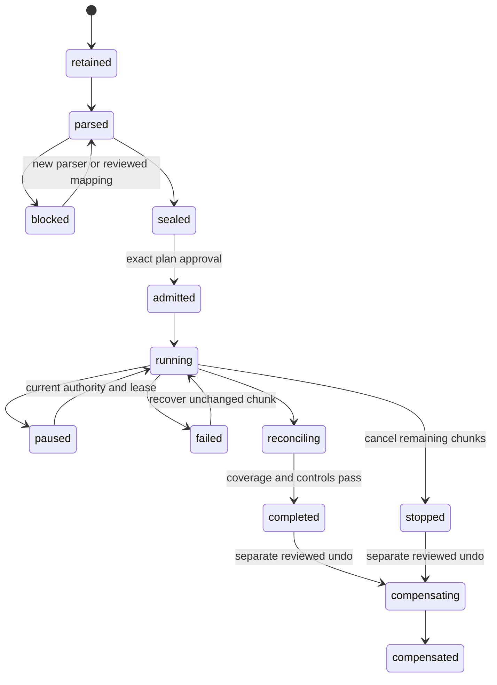

# Imports, matching and reconciliation

Owner: evidence/imports and bank reconciliation. Phase: P2, with durable execution machinery shared with P3/operations. The existing synthetic statement/match/reconciliation APIs and reviewed capacity-allocation draft are retained; they do not yet establish a complete provider migration or source archive.

## Intended workflow

Declare the period's required source accounts and systems, retain original bytes, inspect parsing and coverage, resolve mappings/overlaps, approve the interpretation, import durably, review relationships and reconcile items plus independent totals. The final result identifies exactly which sources and ledger/register cutoff were reconciled. Missing sources and equal-but-ambiguous candidates remain visible.

Supported source families are explicit profiles: normalized bank statements, selected provider resources, historical SIE and linked evidence/register exports. Select the first real provider/format using D-06. The neutral intake contract is implemented before provider breadth; no speculative universal connector is required.

## Data model

| Record                  | Key fields and invariants                                                                                                                                                                                    |
| ----------------------- | ------------------------------------------------------------------------------------------------------------------------------------------------------------------------------------------------------------ |
| Content object          | SHA-256, byte size, media type, immutable storage version and availability. Retain exact original bytes before accepting a reference.                                                                        |
| Source occurrence       | Source system/account, external ID/revision or immutable file+ordinal, effective/observed times, content locator, source payload hash. Same bytes can have multiple occurrences.                             |
| Parser result           | Source hash, parser/profile version, encoding decision, all record locators, normalized facts, unsupported records and diagnostics. Reparse creates a new result.                                            |
| Import plan             | Source inventory, account/dimension mappings, proposed event/recognition identities, opening policy, preserved relationships, expected counts/control totals, excluded records with reasons and plan digest. |
| Import run/chunk        | Admitted plan hash, deterministic chunk membership and hash, lease/fence, state, immutable chunk receipt, counters and failure/continuation position.                                                        |
| Relationship decision   | Source↔event/line/invoice relationship, exact amount/currency, basis `source_asserted`, `reviewed_exact` or `reviewed_heuristic`, reviewer and supersession history.                                         |
| Reconciliation snapshot | Declared inventory, source revision, GL/register cutoff, coverage/check results, unmatched/ambiguous items, independent controls, approved waivers and digest.                                               |

Unique source identity is `(book,sourceSystem,sourceAccount,externalId,revision)` where the provider defines stable IDs. Otherwise use admitted content occurrence plus record ordinal; overlapping exports require an explicit overlap map. Do not collapse identical rows in one file. A source revision can supersede an observation but cannot create a second recognition of the same causal event.

Content deduplication shares bytes only. It preserves acquisition/provenance multiplicity. Source assertions of “paid” or “booked” retain that asserted state and its evidence; missing dated payment history does not become a zero balance or a synthetic payment date.

Historical bulk import holds an explicit book/import-in-progress fence and advances a cursor through a frozen approved manifest. Only the admitted chunks may advance that cursor; unrelated writers cannot introduce competing target history during the import. A lease renewal or retry cannot change chunk membership, mappings or economic effects under the old approval. Committed chunks retain receipts and unresolved chunks remain visible; atomicity applies to each actual transaction, not the entire multi-transaction import.

## Operations and durable state

The import API adds `source-inventories`, `import-previews`, `import-plans` and `import-runs` under the scoped book route. Operations retain/upload content, parse/preview, accept mappings, validate/seal a plan, approve admission, start, inspect, resume, pause/cancel remaining work, and prepare undo/replacement. Read operations expose manifest, rejected records and progress with stable cursors. Existing bank-statement admission stays supported and uses the same occurrence identity beneath it.

Already committed chunks are never erased by cancellation. Undo appends linked corrections, with its own approval, and retains source history. Replacement links old and new admitted source interpretations; an unresolved historical mapping cannot be “fixed” by deleting provenance.

Begin with the reference-informed admission limits: one chunk at most 200 vouchers, 2,000 lines and 1 MiB normalized payload; first supported file limit 50 MiB/50,000 vouchers. These are product bounds to benchmark under the actual runtime, not performance claims. Account for attachments separately with explicit object limits. Reject oversized work or split deterministically before execution; never silently truncate it. Do not hold a browser request open for an entire file.

Leases include a monotonically increasing fencing token. A worker checks it under the transaction lock before committing a chunk. A lease timer alone cannot authorize a stale worker. The chunk receipt, fiscal hold, identities, financial/register effects, checkpoints and counters commit together. A completed receipt makes replay return the same result.

## Historical accounting and openings

SIE profiles retain format/version, exporter identity, encoding, original series/number/date, account/dimension references, final lines, correction-history records and control records. Unsupported variants fail with locators. Final transaction lines and historical correction records have different meanings and cannot all be summed. The [SIE publisher's format catalogue](https://sie.se/format/) distinguishes SIE 4, 4i and 5; treat them as separate capabilities with their own specification/roundtrip fixtures.

Keep source voucher references as immutable external identifiers. Assign native identities independently. If continuing a source's voucher series, initialize its transactional native counter once from the reviewed cutover boundary and retained provenance; never allocate ordinary numbers using a live `MAX(number)` query. Conflicting historical references create an import decision, not automatic renumbering that loses the original.

Choose one opening basis per year: full retained prior history linked to an approved prior close, or an explicitly reviewed migration OpeningSet. A reduced-history midyear migration records the unavailable detail and required comparative limitations. Importing movements and an opening that represents those same movements is refused. Preserve previous filings, period locks, unpaid items, schedules and existing matches when supplied.

While an admitted import affecting a period is incomplete, new complete-readiness claims, close and dependent filing are blocked. Authorized diagnostic reads remain available with the hold and partial state visible. Unrelated books/periods can continue only when their dependencies do not include the changing scope.

## Matching and allocation

Candidate generation is read-only and explains exact reference/provider matches separately from amount/date/name heuristics. Equal amounts alone never establish identity. One source row can match multiple posted lines and one posted line can match multiple observations through signed allocation legs. The existing `settlements.ts` capacity model is the starting point: enforce account/currency/sign consistency and remaining capacity under the book/domain locks.

Approval seals all proposed legs and capacity versions. Recheck at execution; append allocation effects and receipt atomically. Unmatching appends reversal legs with reason and original references, restoring capacity exactly once. Historic exact matches are retained with their original basis; speculative matches are never promoted merely because importing them is convenient.

**Bank matching does not pay an invoice.** It relates external cash evidence to posted cash lines. Commerce owns invoice↔payment allocations. Link the two through the immutable payment event/voucher and preserve both conserved dimensions. No shared mutable “remaining” field serves both meanings.

## Reconciliation and human review

Readiness requires a reviewed source inventory; an empty import table is not an empty bank account. Inventory can explicitly say an account/family is inapplicable or inactive for dates, with evidence. Required accounts, statement intervals and balances must be represented. Checks include source opening plus signed movements equals closing; duplicates/overlap coverage; item allocations; ledger control total; currency/date basis; orphan links; and unclassified/rejected records.

A signoff pins inventory, source and allocation revisions, ledger cutoff, controls and check versions. Subsequent relevant input marks it stale. A waiver records exact difference, reason, authority and affected readiness claim; it cannot waive missing mandatory source coverage or make unsupported legal treatment disappear.

The workbench shows upload/source coverage, parser diagnostics with original locators, mapping preview, durable progress, ambiguous candidates, partial allocation residuals and signoff evidence. Resume must recover the same job. “Complete” appears only after the run and required reconciliation checks agree, not when upload succeeds.

## Delivery packets

| ID     | Deliverable                                                                                | Depends on             | Acceptance                                                                                              |
| ------ | ------------------------------------------------------------------------------------------ | ---------------------- | ------------------------------------------------------------------------------------------------------- |
| IMP-01 | Content/occurrence split, source inventory and immutable parsing/diagnostics.              | FND-03, PST-01         | E-05/E-12: duplicate bytes preserve distinct occurrences; malformed/unsupported records remain visible. |
| IMP-02 | Actual-source profile, loss-preserving SIE/provider mapping and reviewed import plan.      | IMP-01                 | E-12/E-18: supplied history, original references, corrections/dimensions and match basis preserved.     |
| IMP-03 | Bounded durable chunk admission, lease fencing, receipts, pause/resume and compensation.   | IMP-02, PST-05, COR-02 | E-04/E-08/E-17: worker death/reclaim produces one effect; partial period cannot claim complete.         |
| IMP-04 | Reviewed many-to-many bank capacity, unmatch reversal and ambiguity UI over current draft. | IMP-01, PST-02         | E-11/E-13: concurrent allocations cannot overconsume; relationship reversal restores capacity once.     |
| IMP-05 | Inventory-bound reconciliation, independent controls and stale signoff behavior.           | IMP-03, IMP-04         | E-07/E-15: missing account and offsetting missing rows block a zero-difference signoff.                 |
| IMP-06 | Actual-company historical/opening comparison and retained match/filing handoff.            | IMP-05, COM-06         | E-12/E-14/E-16: agreed history scope and all supplied relationships/control totals accounted for.       |

IMP-06 and later cutover consume actual D-04/D-06 material. Synthetic acceptance of the machinery is independently useful but cannot close the actual-data gate.

## Retained interpretation review artifact slice

The [source review artifact handoff](../../apps/api/SOURCE-REVIEW-ARTIFACTS.md) extends IMP-01
with a persisted exact-byte interpretation export. It binds the selected immutable preview and
all its rows/diagnostics to the original occurrence/content hash, plus historical review and
admission summaries without approval bearer material. Scoped capture/get/list support recovery;
oversized complete inputs are refused rather than truncated. Migration3900 and domain-local
REST/MCP contracts and shared wiring are integrated in source. Integrated backend type checks passed; runtime proof remains open;
this does not establish full source coverage or import/posting authority.

## Bounded reconciliation signoff slice

The [bank signoff handoff](../../apps/api/BANK-RECONCILIATION-SIGNOFFS.md) adds a prepared,
operator-signed review of one declared bank account using existing source coverage and capacity
reconciliation reports. It pins inventory/source/allocation/ledger/report digests, requires retained
review evidence, and returns immutable signed JSON with separate stale-state reads. Unknown bank
family applicability and unresolved selected-account controls block signing; other accounts and
source families remain outside its claim. This is an IMP-05 slice, not complete-source assurance,
a waiver mechanism or a new closing gate. Migration3500 and owned transport code are implemented
in source; shared integration and runtime/concurrency evidence remain root gates.

## Whole declared bank-inventory signoff slice

The [whole-inventory signoff handoff](../../apps/api/BANK-INVENTORY-SIGNOFFS.md) extends IMP-05
from3500 selected-account signoff to a complete explicit set of already-signed account plans for
the latest evidenced required bank inventory and one exact period/cutoff. It rejects missing,
extra, duplicate, stale or unsigned members and all known source-coverage gaps.4300 retains full
inventory/member identities and hashes, operator evidence and exact prepared/signed canonical
bytes, with recovery and separate live currentness. Coverage is only the declared bank inventory;
company completeness and financial-close readiness are not established. Source implementation
and owned static checks do not establish runtime/concurrency acceptance. Shared integration and
verification remain root gates. No existing3500, matching, ledger or closing authority is changed.

## Current bounded source-intake packet

The [source-intake handoff](../../apps/api/SOURCE-INTAKE.md) implements a first IMP-01/IMP-02 path in source: immutable bytes/occurrences, explicit bounded UTF-8 CSV mapping, retained diagnostics, operator review and atomic observation admission through the existing bank authority. The first slice is limited to 64 KiB/200 data records and the current synthetic admission profile; it is not a SIE/provider migration, bulk-import engine or actual-company activation. Integration and real runtime/browser/failure observations remain root gates. The handoff contains exact operations, limits, ownership maps and the manual evidence recipe. It does not establish completed IMP-03–IMP-06 acceptance.

Forward migration3200 and the source-intake REST/MCP contracts add explicit immutable reparse supersession for unadmitted previews. A new interpretation retains the same original bytes, links both preview digests and records a rationale; earlier diagnostics/reviews remain recoverable. Superseded previews cannot receive a fresh approval or admission. The revision-history read exposes lineage, diagnostic counts, latest own reviews and any durable admission without reading object storage. Already admitted statements and matches remain unchanged. Integration and static validation do not establish runtime or concurrency proof; the handoff records the pending observations. This does not implement admitted-source replacement, full required-source inventory or a provider connector.

## Known-ID metadata recovery without original storage

IMP-01 now has an additive source-occurrence metadata GET/read-only MCP consumer. It returns the
retained occurrence/provenance, complete preview IDs and safe admission summary without fetching
original bytes or exposing private object descriptors/approval tokens. `originalAvailability`
remains `not_checked`; an object-store outage cannot hide these committed database references.
The existing original download retains its availability/integrity failures. No migration,
artifact, list API or import authority was added, and the current UI remains unchanged. See
[SOURCE-INTAKE.md](../../apps/api/SOURCE-INTAKE.md#metadata-only-occurrence-recovery-failure-contract-before-implementation).
Source/static checks and shared integration remain distinct from pending runtime evidence.

### Bank admission respects existing tax-account reservations

Forward5600 checks the exact selected posted lines against4100's tax-account reservations
when preparing, approving and executing bank allocation, and in the saved plan's live
currentness read. Unusable but still-reserved matches remain blockers until explicit
unmatch. Successful-key replay and saved plan/approval/execution/unmatch history are unchanged.
Candidate discovery keeps each reserved line and its original numeric remaining amounts,
but marks it ineligible with `tax_account_reserved`; existing EN/SV blocker copy explains
that restriction. Reconciliation, signoff and unmatch calculations do not lose those lines
or their residual differences. No global role policy or capacity-version format is added.
See [bank admission](../../apps/api/BANK-TAX-RESERVATION-ADMISSION.md).
Source is integrated; independent review and current static checks are tracked in the
[active wave](accounting-completion-wave.md). Runtime behavior remains unverified.

### Exact source-mapping currentness

Forward5900 closes a mapping-currentness gap without changing saved dependency digests.
If a retained source acquires a conflicting ledger-account mapping after preview, fresh
approval/admission now refuses and preview/new review-artifact currentness becomes false.
The check uses the same exact two-way mapping rule as parsing/import, not a whole-book
inventory. Unrelated mappings do not stale the preview through this predicate. Original-key
recovery, admitted history, supersession and previously captured bytes stay unchanged.
Independent source review found no actionable blocker; SQL/runtime behavior remains unverified.
See [source intake](../../apps/api/SOURCE-INTAKE.md).

### Source-retention recovery by request key

Forward6300 adds `GET /api/v1/entities/:entityId/books/:bookId/source-retention-requests/:key`
and read-only `source_recover_retention`. A caller that loses the retention response can
recover its frozen `SourceOccurrence` without the original file, bytes or object storage.
The read requires current scope authorization and the exact committed command's actor,
book, key and retention operation. Deduplicated results retain the original occurrence's
actor/key provenance; that is not used to authorize this request.

Pending uploads are not completed. Missing results are absence at this check, not proof that
an in-flight command failed or permission to use a new key. No approval/admission material,
private object locator, request payload or current-availability claim is returned. Root and
independent source review found no blocker; native type checks and targeted lint passed.
SQL application/execution and response-loss recovery remain runtime-unverified. See
[source intake](../../apps/api/SOURCE-INTAKE.md).

## Wave 2 bounded source breadth

The [bank connector handoff](../../apps/api/BANK-CONNECTOR.md) retains operator-delivered raw records, attested consent/account mapping, cursor/revision overlap and retry identities behind source intake; existing file import remains usable. It cannot fetch from a live provider or prove provider consent while D-10 remains open.

The [SIE historical source handoff](../../apps/api/SIE-HISTORICAL-IMPORT.md) retains bounded SIE4 parsing, encoding/record diagnostics, reviewed account and independent-control plans, and resumable fenced synthetic staging. Staging is not financial import. Actual source selection (D-06), OpeningSet authority and prior-history versus opening basis, and historical open-item recognition/settlement contracts are missing. No financial opening, prior payment/match or corrected voucher is created. The [isolated migration smoke](evidence/wave2-local-migration-smoke.md) proves schema application/replay only, not IMP-02/03/06 behavior or reconciliation.
