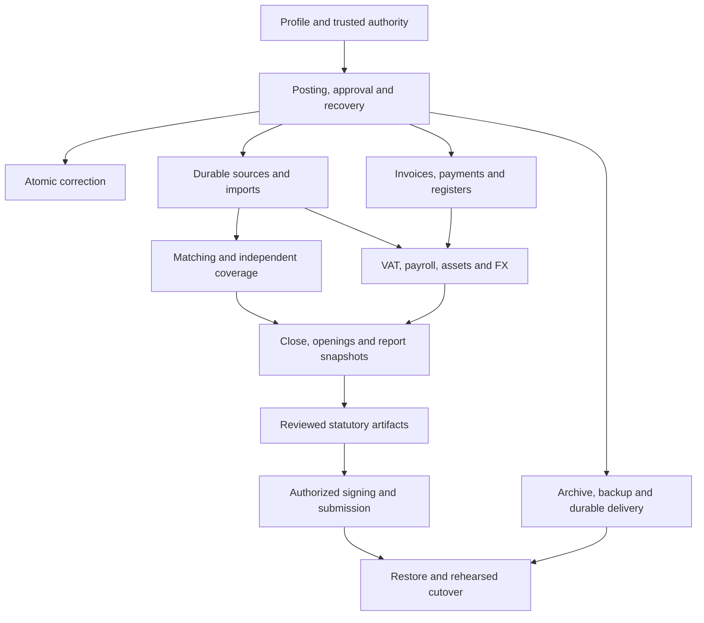

# Complete delivery design for the seven accounting areas

Status: **fully specified working plan; implementation and acceptance remain separate**. Prepared 2026-09-22 at the user's request. “Fully specified” means every listed area has a bounded scope, owning records, operations and authority, state/failure behavior, integration points, delivery packets and observable acceptance criteria. It does not mean every company fact, legal rule, provider contract or operational deployment is already known.

The [application-owned accounting replacement plan](application-owned-accounting.md) proposes a new TypeScript/Effect ownership boundary and a clean database baseline, based on the user's confirmation that there are no users or deployed data to preserve. It is a planning artifact, not implemented behavior. Its implementation includes reconciling the SQL ownership and old-schema preservation requirements below.

This plan extends the maintained [roadmap](../roadmap.md), [domain invariants](../domain.md), [operations](../operations.md) and [verification scenarios](../verification.md). The detailed rules below are selected design decisions, not claims that all current code implements them. [ADR 0004](../adr/0004-complete-accounting-delivery-contract.md) records the consequential choices and alternatives.

## Coverage

| Requested area                          | Planning status and specification                                                                                                                       | Release boundary                                                              |
| --------------------------------------- | ------------------------------------------------------------------------------------------------------------------------------------------------------- | ----------------------------------------------------------------------------- |
| Posting, approval, receipts             | [Specified](01-posting-approval-receipts.md): identity, sealed plans, approval lifecycle, atomic receipts, recovery and delivery.                       | A fixed revision passes real-boundary failure cases.                          |
| Corrections                             | [Specified](02-corrections.md): exact reversal, atomic replacement, linked business-register consequences and closed-period handling.                   | No half-correction or editable posted history.                                |
| Imports, matching, reconciliation       | [Specified](03-imports-matching-reconciliation.md): content/occurrence identity, durable imports, preserved history, allocations, coverage and signoff. | One permitted actual period reconciles with retained relationships.           |
| Invoices, payments, business registers  | [Specified](04-invoices-payments-registers.md): parties, invoice revisions, recognition, open items, payments, credits and controls.                    | Every commercial/financial assertion has consistent accounting support.       |
| VAT, payroll, assets, FX                | [Specified](05-vat-payroll-assets-fx.md): separate rule profiles, calculations, schedules, valuation, returns and controls.                             | Each applicable treatment has sourced rules and independent expected results. |
| Year-end, statutory reports, filing     | [Specified](06-year-end-reports-filing.md): close/opening, report lineage, tax bridge, disclosures, export and external outcomes.                       | Complete relevant year and exact artifact/acceptance evidence.                |
| Restore, production operations, cutover | [Specified](07-restore-operations-cutover.md): archive, consistent backup, quarantined restore, delivery, deployment and writer transfer.               | Full application recovery and a rehearsed, authorized cutover.                |

Read [shared contracts](00-shared-contracts.md) first, then the relevant domain. [Delivery order](08-delivery.md) connects the packets; [acceptance and traceability](09-acceptance.md) describes the proof required. [External inputs](10-external-inputs.md) gives an owner, gate and concrete deliverable for each fact we cannot invent.

The backlog contains **53 work packages** with 101 mandatory dependency edges, plus separate company/profile release gates. The [generated index](evidence/work-packages.json) includes a valid implementation order. [FND-01 reconciliation](fnd01-reconciliation.md) is complete for its pinned checkpoint. Continue with FND-02/FND-03/FND-04, comparing later concurrent changes against that baseline; do not restart completed work from the historical source description.

## Supplemental product capabilities

The [capability backlog and coverage map](capability-backlog.md) maps every item in the supplied SALES/PUR/BANK and related list to its existing owner and adds explicit collections, sales operations, dimensions, expense/payroll handoffs and extension requirements. The [comparison reconciliation](capability-backlog.md#repository-comparison-reconciliation) additionally covers supplier OCR/email intake, party master data, recurring sales, conditional ROT/RUT and deadlines/calendar, and resolves assignment aliases. These supplemental requirements are outside the 53-packet accounting index; they are planned scope, not completed implementation or acceptance.

## Current source baseline

The checkout has advanced beyond the early baseline in the research dossier. HEAD at planning capture was `1965622afa65285fa8e9013ccdd98a47ebe86dfb`, with concurrent changes. The [planning manifest](evidence/planning-baseline.json) records source hashes and the existing dirty state.

Observed source includes the synthetic posting lifecycle, bank statements/matches, case context, trial-balance snapshots/explanations, recurring preparation and readiness. Concurrent files add recovery discovery, correction bundles, reviewed bank allocations, schedules, technical closing and local backup/restore tooling. Existing E2E files and result artifacts also exist. This planning task did not run those suites or promote their results into a whole-phase acceptance claim. No production-ready flag is inferred from a file's presence.

The implementation packets therefore start with **reconcile and complete the existing slice**, not “build everything from zero.” Existing routes, receipts, immutable migration history and synthetic evidence are preserved. Applied migrations are never rewritten to conform to the plan.

## Product boundary

The target is a complete accounting workflow for the selected Swedish company profile, with the seven areas designed for further supported profiles. Initial company delivery does not require implementing an inapplicable payroll scheme or every K3 disclosure, but applicability must be explicitly established. “Not applicable” requires a dated company fact and reviewer; “not implemented” remains a blocker when applicable.

Planned breadth includes both accrual and cash-method recognition profiles; invoices/credits/partial settlements; ordinary and cross-border VAT families; payroll and its declarations; assets/deferrals; FX; close/opening; tax and annual-report artifacts; SIE profiles; and connected delivery. Each is separately activated after its own rule and acceptance gate. The narrow domestic VAT research is a candidate first release, not permission to mark all Swedish VAT supported.

General CRM, sales pipelines, a plugin marketplace, inventory/warehouse management, industry-specific ERP beyond required accounting treatments, and other jurisdictions are outside this seven-area plan. A necessary accounting treatment discovered in real source inventory becomes a named profile packet before company release; it cannot be silently dropped to meet a milestone.

## Completion has three independent axes

| Axis                  | Allowed status                                                                            |
| --------------------- | ----------------------------------------------------------------------------------------- |
| Design                | Specified, or a named missing product decision with owner and gate.                       |
| Implementation        | Absent, partial, implemented at a revision.                                               |
| Proof / applicability | Unverified, synthetic verified, company verified, externally acknowledged where required. |

The planning pass closes the first axis for the seven areas by choosing technical defaults and specifying conditional paths. It does not close the other axes. User approval for this planning work does not authorize new tests, production data use, deployments, payments or filings. Existing permissions from an implementation task must be checked in that task; this plan neither revokes nor expands them.

## Intended end-to-end result

Edges express required inputs, not a mandate to work serially on independent modules. Operations/restore design starts early; production cutover waits for every applicable company workflow. The exact packet dependencies are recorded in the delivery index.

## Maintaining and checking this plan

Update packet rows in their owning domain and conditional gates in the delivery document. Run `python3 docs/plans/check-plan.py` to regenerate the index and [planning integrity artifact](evidence/planning-integrity.json). The [checker](check-plan.py) validates unique IDs, mandatory dependency order, all seven areas, R/I/E coverage and local links/anchors. It executes no application tests. Review semantic changes separately and update the ADR, company-input gates and acceptance expectations together.
