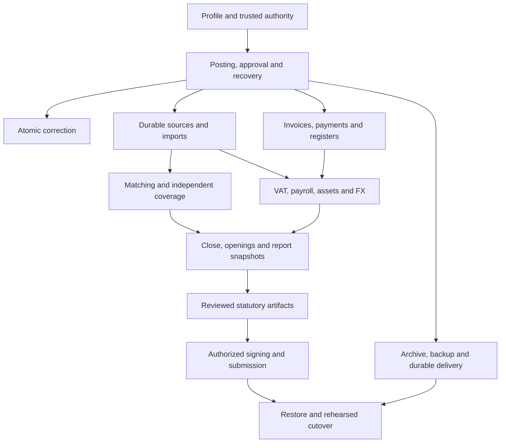

# Complete delivery design for the seven accounting areas

**Commercial sequence, adopted 2026-10-03:** [ADR 0017](../adr/0017-bureau-first-product-focus.md) prioritizes the bureau-led documents/bank/invoicing/VAT loop, canonical human tasks, bounded bulk review and qualified connected execution. Native payroll is deferred for specialist integration evaluation; Cash and peripheral commerce/ERP surfaces follow the core loop. The ready order below gives the implementation sequence; the retained packets and dependencies describe technical obligations, not a mandate to deliver the full suite before the wedge. Applicable company accounting, corrections, reconciliation, handoff and recovery gates remain; unsupported actual cases cannot be silently omitted. No automatic posting is adopted.

Status: working design for seven accounting areas. The packets define ownership, behavior, dependencies and acceptance. Implementation, company qualification and external acceptance remain separate.

Start with [Book Zero](15-book-zero-workflow-cash.md) for the customer outcome and [the comparison reconciliation](16-comparison-reconciliation.md) for the current work order. Use the domain packets below to implement each step.

[ADR 0010](../adr/0010-application-owned-accounting-replacement.md) owns the application/SQL boundary. [ADR 0009](../adr/0009-effect-mq-background-jobs.md) owns durable work through effect-mq on a separate Bun process. The [replacement evidence](evidence/application-owned-replacement-complete.md) records the local cutover checks. It does not establish company readiness.

## Coverage

| Requested area                          | Planning status and specification                                                                                                                       | Release boundary                                                              |
| --------------------------------------- | ------------------------------------------------------------------------------------------------------------------------------------------------------- | ----------------------------------------------------------------------------- |
| Posting, approval, receipts             | [Specified](01-posting-approval-receipts.md): identity, sealed plans, approval lifecycle, atomic receipts, recovery and delivery.                       | A fixed revision passes real-boundary failure cases.                          |
| Corrections                             | [Specified](02-corrections.md): exact reversal, atomic replacement, linked business-register consequences and closed-period handling.                   | No half-correction or editable posted history.                                |
| Imports, matching, reconciliation       | [Specified](03-imports-matching-reconciliation.md): content/occurrence identity, durable imports, preserved history, allocations, coverage and signoff. | One permitted actual period reconciles with retained relationships.           |
| Invoices, payments, business registers  | [Specified](04-invoices-payments-registers.md): parties, invoice revisions, recognition, open items, payments, credits and controls.                    | Every commercial/financial assertion has consistent accounting support.       |
| VAT, payroll, assets, FX                | [Specified](05-vat-payroll-assets-fx.md): separate rule profiles, calculations, schedules, valuation, returns and controls.                             | Each applicable treatment has sourced rules and independent expected results. |
| Year-end, statutory reports, filing     | [Specified](06-year-end-reports-filing.md): close/opening, report lineage, tax bridge, disclosures, export and external outcomes.                       | Complete relevant year and exact artifact/acceptance evidence.                |
| Restore, production operations, cutover | [Specified](07-restore-operations-cutover.md): archive, consistent backup, quarantined restore, delivery, deployment and writer transfer.               | Full application recovery and a rehearsed, authorized cutover.                |

Read [shared contracts](00-shared-contracts.md) first, then the relevant domain. [Delivery order](08-delivery.md) connects the packets; [acceptance and traceability](09-acceptance.md) describes the proof required. [External inputs](10-external-inputs.md) gives an owner, gate and concrete deliverable for each fact we cannot invent.

The [generated index](evidence/work-packages.json) contains **53 work packages** and their mandatory dependencies. Company release gates are separate. Read current code and evidence before starting a packet; its original description may predate landed work.

## Supplemental product capabilities

These records map requirements to owners. They do not add to the 53-packet completion count or prove implementation.

| Record | Purpose and use |
| --- | --- |
| [Capability backlog](capability-backlog.md) | SALES/PUR/BANK and related requirements, including intake, party data, recurrence and conditional ROT/RUT. |
| [Reference parity backlog](11-parity-backlog.md) | PRY proposals, owners and adoption classes under [ADR 0011](../adr/0011-reference-parity-backlog.md). |
| [Reference parity ledger](14-parity-ledger.md) | Coverage findings and unowned gaps. A coverage label is not runtime proof. |
| [Reference-derived defects](13-reference-derived-defects.md) | Reported defects in existing behavior. Check current source before fixing them; [ADR 0013](../adr/0013-reference-derived-defects.md) governs placement. |
| [NEXT dossier](12-next-implementation-dossier.md) | Design input for NEXT-01…125 mapped to existing owners under [ADR 0012](../adr/0012-next-implementation-dossier.md), as amended for the third, fourth and fifth waves. NEXT identifiers are not migration numbers. |
| [Plan review adoption](14-plan-review-adoption.md) | Unadopted corrections to parity and test plans. Read before using a PRY recipe or the proposed harness. |
| [Accounted comparison reconciliation](16-comparison-reconciliation.md) | All FWD proposals mapped to current owners, Book Zero order and evidence limits. |

Keep external design sources under [their provenance rules](../specs/README.md). Apply forward changes to released databases; do not rewrite the reviewed baseline.

## Book Zero customer outcome

The [Book Zero, daily work and Drastic Cash plan](15-book-zero-workflow-cash.md) integrates the openERP-specific PRD received 2026-09-27. It prioritizes a reviewed Drastic period and normal daily work, then a read-only daily payment forecast over the same authoritative sources. It maps source requirements and L0–L7/G0–G7 to current owners; those identifiers do not add packets or alter the 53-packet denominator.

Existing accounting plans retain imports, posting, commerce, tax/payroll, year-end and cutover. The supplemental Cash contract owns prospective basis, contributions, quality and scenarios; NEXT-45 retains the historical cash-flow statement. The source is [preserved separately](../specs/README.md#book-zero-prd). Broader Drastic platform modules are not adopted by this documentation update, and all implementation/company/external proof remains separate.

## Current source baseline

Use [NEXT progress](next-packet-progress.md), [landed repairs](evidence/latest-landed-review-repairs.md) and the [comparison baseline](16-comparison-reconciliation.md#source-and-method) for dated implementation observations. The [original planning manifest](evidence/planning-baseline.json) is historical evidence, not today's work queue.

Preserve public contracts, immutable receipts and dated evidence. Compare the relevant source changes before reusing an older result. A green core suite does not qualify every feature that imports the same kernel.

## Product boundary

The target is a complete accounting workflow for the selected Swedish company profile, with the seven areas designed for further supported profiles. Initial company delivery does not require implementing an inapplicable payroll scheme or every K3 disclosure, but applicability must be explicitly established. “Not applicable” requires a dated company fact and reviewer; “not implemented” remains a blocker when applicable.

Planned breadth includes both accrual and cash-method recognition profiles; invoices/credits/partial settlements; ordinary and cross-border VAT families; payroll and its declarations; assets/deferrals; FX; close/opening; tax and annual-report artifacts; SIE profiles; and connected delivery. Each is separately activated after its own rule and acceptance gate. The narrow domestic VAT research is a candidate first release, not permission to mark all Swedish VAT supported.

General CRM, sales pipelines, a plugin marketplace, inventory/warehouse management, industry-specific ERP beyond required accounting treatments, and other jurisdictions are outside this seven-area plan. A necessary accounting treatment discovered in real source inventory becomes a named profile packet before company release; it cannot be silently dropped to meet a milestone.

## Completion has three independent axes

| Axis                  | Allowed status                                                                            |
| --------------------- | ----------------------------------------------------------------------------------------- |
| Design                | Specified, or a named missing product decision with owner and gate.                       |
| Implementation        | Absent, partial, implemented at a revision.                                               |
| Proof / applicability | Unverified, synthetic verified, company verified, externally acknowledged where required. |

The planning pass closes the first axis for the seven areas by choosing technical defaults and specifying conditional paths. It does not close the other axes. User approval for this planning work does not authorize new tests, production data use, deployments, payments or filings. Existing permissions from an implementation task must be checked in that task; this plan neither revokes nor expands them.

## Intended end-to-end result

```mermaid
flowchart TD
  F[Profile and trusted authority] --> P[Posting, approval and recovery]
  P --> C[Atomic correction]
  P --> I[Durable sources and imports]
  I --> R[Matching and independent coverage]
  P --> B[Invoices, payments and registers]
  B --> D[VAT, payroll, assets and FX]
  I --> D
  R --> Y[Close, openings and report snapshots]
  D --> Y
  Y --> A[Reviewed statutory artifacts]
  A --> S[Authorized signing and submission]
  P --> O[Archive, backup and durable delivery]
  O --> T[Restore and rehearsed cutover]
  S --> T
```

Edges express required inputs, not a mandate to work serially on independent modules. Operations/restore design starts early; production cutover waits for every applicable company workflow. The exact packet dependencies are recorded in the delivery index.

## Maintaining and checking this plan

Update packet rows in their owning domain and conditional gates in the delivery document. Run `python3 docs/plans/check-plan.py` to regenerate the index and [planning integrity artifact](evidence/planning-integrity.json). The [checker](check-plan.py) validates unique IDs, mandatory dependency order, all seven areas, R/I/E coverage and local links/anchors. It executes no application tests. Review semantic changes separately and update the ADR, company-input gates and acceptance expectations together.
