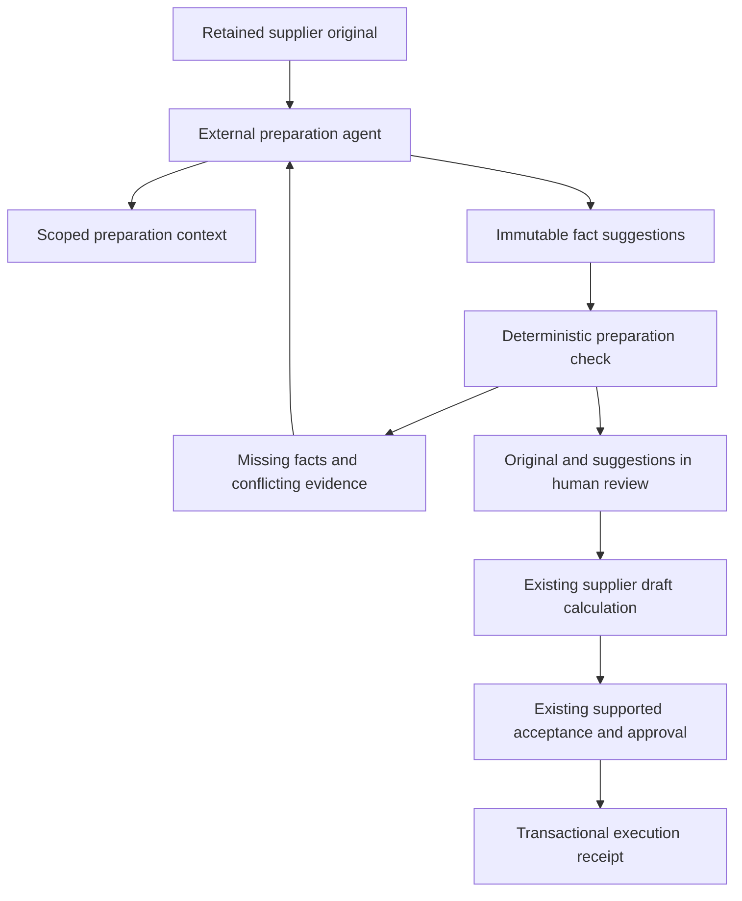

# Agent-assisted preparation: research and implementation proposal

2026-09-24. **Proposed; not an accepted ADR, implementation, or verification result.**

This report answers: which parts of Kyoto's approach should OpenERP adopt, and what is the smallest useful implementation? It refines the existing [AGT-2 / supplier-inbox backlog](capability-backlog.md#supplier-inbox-and-extraction), rather than introducing another accounting roadmap.

Source inspection used checkout HEAD `ea5554c22fb6caf2810f59ee159503a3b1dc6aea` plus the current working tree. Pre-existing collection edits and untracked local configuration/migrations were left untouched. No application, database, provider, model evaluation, or test suite was run for this research.

**Recommendation:** deliver supplier-invoice preparation through an external agent and the existing REST/MCP boundary. Let the agent read retained evidence, propose typed facts, and ask questions driven by deterministic diagnostics. Keep operator fact review and financial approval in their current owners. Extend the same approach to VAT preparation after this loop works.

The follow-up [document classification and field-selection proposal](document-classifier-proposal.md) specifies the document-reading experiment and its integration. It puts general classification under source intake, proposes a Jev comparison before adoption, and distinguishes header suggestions from the full line details required by a supplier draft. That narrower first experiment does not implement or replace this whole preparation loop.

## What the research supports

[Kyoto](https://heykyoto.com/blog/solving-taxcalcbench) describes Prep gathering facts from a simulated taxpayer and Taxer calculating returns. It reports 50/50 cases, with one disputed case scored under its interpretation rather than the official key. The article does not provide enough execution detail to independently reproduce that combined result. Transfer the separation of responsibilities; treat reliability as something OpenERP must measure itself.

[TaxCalcBench](https://github.com/column-tax/tax-calc-bench) evaluates calculation from supplied taxpayer information. Its current TY2025 leaderboard reports 64% strict return accuracy for the leading listed model with web search; strict success requires every evaluated line to match. Comparing that model task with a system equipped with a purpose-built engine does not isolate the effect of interviewing, model choice, or orchestration. Neither result measures Swedish accounting support.

Dataset versions matter: the benchmark maintainers [merged corrections to two California cases](https://github.com/column-tax/tax-calc-bench/pull/108), including inputs and expected outputs. That correction is separate from Kyoto's reported SEP dispute; it does not settle that dispute. Pin inputs and answer keys, and report any alternative scoring explicitly.

Kyoto also publishes a [document classifier](https://github.com/kyotofin/tax-doc-classifier). It classifies page text into IRS form categories; its PDF helpers require Poppler and its backend uses an external service. It is not a Swedish invoice extractor or tax engine. Its useful lesson is to evaluate document classification separately from field extraction and calculation. There is no demonstrated reason to add that dependency here.

A deterministic calculator can still encode the wrong rule. Likewise, a schema-valid extracted value can be false. The implementation needs independent expected outcomes and evidence review alongside reproducible arithmetic.

## Current OpenERP path

The following are source-backed observations, not new runtime proof.

| Existing owner | What exists | Consequence for this proposal |
| --- | --- | --- |
| [Source retention](../../apps/api/src/application/source-retention.ts) | Original-byte validation, object hashes, scoped retrieval, command replay, and authorization recheck after external reads | Use existing occurrence identities and private retrieval; do not create a second document store. |
| [Supplier inbox contract](../../packages/contracts/src/supplier-inbox.ts) and [SQL](../../apps/api/migrations/9010-ap-intake.sql) | Immutable extraction attempts containing suggestions, source locations, confidence and diagnostics; one reviewed draft per registered occurrence | Extend this proposal history. Current registration, extraction recording and review all require operator authority. |
| [Supplier inbox UI](../../apps/web/src/components/commerce/supplier-inbox.tsx) | Original preview, manually recorded extraction failures, and entry into invoice editing | OCR is explicitly unconnected. This is the first useful product surface for suggestions. |
| [Supplier draft calculation](../../apps/api/migrations/6900-supplier-invoice-drafts.sql) and its [current shared calculator](../../apps/api/migrations/9080-invoice-catalog-selections.sql) | Exact explicit-line calculations, source-total comparisons, dependency checks and blockers | Reuse these calculations; do not recalculate invoice totals in an LLM or a new TypeScript helper. |
| [Capability execution](../../apps/api/src/application/capabilities.ts) and [MCP](../../apps/api/src/transport/mcp.ts) | Shared operations, generated schemas, scoped credentials and structured success/error envelopes | Add named capabilities with matching REST callers. Existing inbox routes call SQL directly and have no ordinary MCP entries. |
| [Case context](../../packages/contracts/src/cases.ts) | Bounded immutable manual-journal context, source references and next actions | Its current case kind is manual journals. Do not pretend supplier documents already fit that contract. |
| [VAT workflow](../../apps/api/src/application/vat-returns.ts) and [calculator](../../jurisdictions/se/src/vat/calculation.ts) | Capture basis → calculate → seal; source/ledger checks and immutable draft results | Already follows the engine pattern. Actual-mode contributions remain excluded; filing readiness, legal activation and coverage remain false. |
| [Preparation jobs](../../apps/api/src/application/preparation-jobs.ts) | Durable recurring preparation with PostgreSQL authority and a Cloudflare adapter | This is not an existing LLM interview runtime. Reuse its lifetime principles later, not its business payload. |

The [operations design](../operations.md#governed-rules-and-agent-context) already calls for interpretation provenance, bounded context and separate evaluation of proposal quality. The missing work is a complete caller path for those requirements.

## Alternatives and first boundary

| Candidate | Strength | Cost or limitation | Recommendation |
| --- | --- | --- | --- |
| External agent over REST/MCP, persisted proposals, existing web review | Reuses current credentials, source APIs and review; model can change without changing accounting | Needs a small host-side document reader and explicit proposal capabilities; conversation happens in the agent client | Start here. |
| Embedded assistant in Purchases | One in-product conversation and controlled document/model delivery | Adds provider configuration, document processing, durable model work, cancellation, budgets and conversation UX | Add after the first loop passes evaluation. |
| Autonomous general tax/accounting agent | Broad apparent scope | Crosses unresolved profile boundaries and requires much more evidence and operational machinery | Outside this first implementation. |

The first release processes one registered supplier original at a time. The operator uploads/registers it using the existing UI; the agent prepares suggestions and questions; the operator reviews against the original and creates the existing draft. This is a complete preparation outcome. Existing supported acceptance/posting remains a separate human-controlled continuation.

Use uploaded PDFs/images that the selected agent host can actually read. A scoped API returning base64 is not itself PDF extraction: the host adapter must retrieve through the existing source API, check the returned digest, decode the bytes, and present bounded pages/text to its document-capable model. If the host cannot read the document, return an explicit failure and preserve manual entry. No Poppler process is assumed to run inside a Worker.

## Proposed caller flow



All nodes after the external agent use OpenERP's shared application and database owners. The arrows describe proposed integration. They are not a claim that the current source executes this whole flow.

Proposed capability names, to be finalized with contracts:

```text
supplier_preparation_get_context(scope, occurrenceId)
  -> original reference, current proposal, dependencies, diagnostics, review link

supplier_preparation_record(scope, occurrenceId, expectedProposalDigest,
                            idempotencyKey, observations, provenance)
  -> immutable proposal identity and receipt

supplier_preparation_check(scope, occurrenceId, proposalDigest)
  -> needs_input | ready_for_review | unsupported
     + currentness, diagnostics, optional exact calculation preview
```

The external agent discovers these using `tools/list`. It records new observations, checks them, asks only for unresolved factual inputs, and stops at a review link. Source instructions never choose tools, credentials, or scope. The first agent client uses an explicit preparation/read tool allowlist, excluding financial execution; backend role and approval enforcement remain authoritative for every caller.

### Facts and provenance

Extend the existing immutable extraction-attempt owner with a versioned, typed preparation payload. Preserve legacy attempts and current inbox responses; introduce additive contracts or an explicit versioned projection where needed. Do not reinterpret stored manual attempts as model-generated records.

For the supported supplier fields, distinguish:

- **Unknown:** no supported value and an explicit reason. Missing money is not zero.
- **Observed:** a typed candidate value with source occurrence/digest and page/region, text span, or structured-field locator.
- **Conflicting:** the competing values and their separate source references.

Use canonical money strings and existing date/currency schemas. Keep incomplete line extraction explicit, including unprocessed pages; a matching total cannot certify that all lines were read. Keep proposed account and VAT treatment distinct from printed invoice facts and human-reviewed accounting choices.

Retain extraction/model identifier, parser/prompt/schema versions, source references, and concise decision evidence. The server binds actor, scope, original hash, proposal revision and receipt. Model provenance supplied by an external client is a client assertion, not server attestation. Confidence is advisory and cannot promote a field to reviewed or establish deductibility.

Questions are derived from diagnostics rather than stored in a second workflow engine. Answers used as evidence are retained through the existing evidence owner, with actor/time attribution; later proposals cite them. Acceptance records the chosen proposal digest and the operator's corrections. Neither an answer nor a model suggestion is automatically an operator tax review.

### Diagnostics and calculation

Each diagnostic contains a stable code, relevant field/line, evidence references, and a resolution category: `provide_fact`, `resolve_conflict`, `operator_review`, or `unsupported_profile`. Include a suggested question only when an answer can resolve the gap. Do not repeatedly ask a user to fix a missing product capability.

For example, conflicting invoice totals must expose both source locations. An unknown purchase purpose can prompt a factual question. A missing legal tax profile requires a product/domain release; it cannot be cleared by the agent declaring a rate supported.

Run input-completeness checks before invoking the existing supplier calculator. When sufficient explicit inputs and scoped references exist, a new authenticated preparation wrapper calls `supplier_invoice_draft_calculate` without creating or accepting a draft. Reuse its exact totals and blockers. The wrapper adds diagnostic context; it does not duplicate its monetary policy. Insufficient inputs return no invented totals. Invalid references and forbidden access remain errors, not friendly success states.

`ready_for_review` means a bounded proposal is available for a human to inspect. It does not mean tax eligibility, acceptance, posting, complete source coverage, or statutory readiness.

### Authority, revisions and failures

Add a dedicated SQL transition for scoped agents to append **unreviewed suggestions** to an already registered original. Keep current operator-only registration, review, draft mutations, tax reviews and approval functions restricted. Do not widen the existing extraction function and inadvertently grant review power.

Bind each new proposal to the expected previous proposal digest and original identity. Bind checks and review to exact proposal and relevant dependency revisions. Concurrent proposals produce a stale/conflict result; source replacement or a revised counterparty requires fresh checking. An old attempt remains readable but cannot silently overwrite the current selection or an already reviewed invoice.

Keep model calls and document reads outside database transactions. A lost recording response is recovered by the unchanged idempotency key and original payload. Preserve the selected extraction output across retries; do not rerun the model and reuse the same key for a different result. Fresh extraction is an explicit new attempt. Check `isError` on MCP tool results before interpreting success data.

## Implementation sequence and exit conditions

Each row is a proposed delivery slice, not completed work.

| Slice | Main changes | Observable exit |
| --- | --- | --- |
| 1. Preparation contract and authority | Extend supplier-inbox contracts; forward migration for versioned proposals, currentness and narrowly scoped suggestion writes; register shared Effect capabilities and REST handlers | A real scoped agent can record/read/recover a suggestion, but cannot review facts, mutate drafts or approve; old attempts remain readable. |
| 2. Context and deterministic feedback | Add `apps/api/src/application/supplier-preparation.ts` and its parameterized SQL statements; bounded context, completeness diagnostics and wrapper around the existing calculator | A missing value produces a specific diagnostic; a conflicting total retains both observations; complete explicit inputs yield the canonical calculation; cross-book/stale input fails. |
| 3. Agent and human workflow | Repo-owned agent instructions and host document adapter; extend the existing supplier inbox/editor to show and select suggestions, corrections, questions and original citations | Real PDF/image → recorded suggestions → question/answer → operator review → saved supplier draft; reload recovers exactly the same source and proposal lineage. |
| 4. Evaluation and release evidence | Approved E2E and model evaluation work, independent fixtures, repeatability artifacts and the existing supported accounting continuation | No authority or duplicate-effect failure; repeatable preparation-quality results and an inspectable source-to-draft/review/receipt chain. |

Slices 1–3 are necessary for the proposed preparation feature; exposing tools alone is not completion. Define and, when authorized, write the decisive failure scenarios **before** implementation. Slice 4 runs and records that planned proof; it is not a request to backfill unit tests.

Likely affected existing files: `packages/contracts/src/supplier-inbox.ts`, capability/API exports, `apps/api/src/application/capabilities.ts`, `apps/api/src/transport/http/routes/supplier-inbox.ts`, `apps/api/src/db/statements/supplier-inbox.ts`, the supplier-inbox/editor components, and forward migrations. New files need only the concrete preparation operation and client instructions/adapter. No new accounting package, generic fact graph, agent framework, or model SDK is a prerequisite.

## Decisive verification

Use the [existing E2E strategy](../verification-strategy.md) and [actual suite limitations](../../apps/api/tests/README.md). The current suite does not supply automated browser or supplier AP coverage. This proposal creates no test files; implementation must resolve test-change scope under AGENTS.md/D-09 before adding them.

Specify expected failures first:

| Scenario | Required observation |
| --- | --- |
| Missing amount, unreadable page or partial extraction | Unknown/incomplete result, preserved original and manual recovery; no guessed zero or complete-document claim. |
| Contradictory OCR, user answer, or printed total | Both values retained; explicit conflict; no silent repair to make arithmetic balance. |
| Prompt injection in a document | Content remains evidence; no new scope, authority, tool access or external action. |
| Wrong book or revoked credential | No source disclosure or saved proposal; direct REST and MCP enforce the same restriction. |
| Same bytes, distinct legitimate occurrences | Both business occurrences survive; duplicate candidates are reviewed rather than automatically collapsed. |
| Retry, lost response, or concurrent proposal | One saved result per command identity; changed payload conflicts; currentness prevents overwrites. |
| Operator changes the source/selection during preparation | Stale proposal cannot be silently adopted; earlier attempts and reviewed history remain intact. |
| Unsupported VAT treatment, foreign currency or credit note | Explicit unsupported path for this slice; no automatic standard-rate or gross-cost fallback. |
| Human reviews and continues through existing supported acceptance | Exact source/proposal/review identities survive reload; financial effects occur only through the existing approval and execution path. |

Keep two evaluation lanes. First, replay recorded candidate outputs through real HTTP/MCP, Worker, PostgreSQL and browser paths to prove contracts and financial invariants. Second, run the real agent/document model against independently reviewed holdouts to measure preparation quality. Recorded model outputs do not prove live extraction accuracy.

Measure whole-document correctness and line/field correctness separately; also measure unsupported-case detection, invented facts, unnecessary questions, human corrections, repeated-run consistency, tool calls, bytes/tokens, cost and elapsed time. Freeze model/prompt versions and define thresholds before examining holdout results. Keep a held-out document set and a scripted fact oracle; a simulated user must not have access to answer keys or leak unasked facts. Disputed expectations remain separately reported.

The repeatable artifact should include a revision/environment manifest, source hashes, model/prompt versions, sanitized tool transcript, expected versus observed facts and diagnostics, proposal/review/receipt IDs, browser evidence, and exact replay commands. Require zero unauthorized writes and zero duplicate financial effects in the exercised safety scenarios. Do not label a small passing corpus as general accounting reliability.

## Extension to VAT and rule maintenance

After supplier preparation works, apply the diagnostic contract to existing `VatBlocker` values and operator-reviewed VAT facts. Reuse `prepareVatDraft` and `calculateVatDraft`; preserve saved engine versions and original results. The agent gathers registration, period, business-purpose and date-basis evidence; the operator retains eligibility-review authority.

Actual VAT preparation is a separate release. The [earlier research ADR](../adr/0002-swedish-vat-profile-boundary.md), [later rounding research](../sources/vat-return-profile-research.md), current calculator and [open decisions](../open-decisions.md) must be reconciled. Later research narrows some rounding uncertainty but does not activate a legal profile, establish complete coverage, or resolve VAT settlement. Do not remove the current false readiness flags as part of agent integration.

For future rule changes, use dated primary sources, explicit validity intervals, independent acceptance examples, versioned calculations and human domain review before release. Coding agents can implement the reviewed change through the normal repository process. Runtime agents should consume released rules, not modify tax logic during a customer conversation. Simulation outputs must identify their assumptions and must not mutate accepted facts.

The first implementation decision is therefore concrete: **build the supplier preparation loop in slices 1–4; use its measured results to decide whether to embed the agent and then expand jurisdiction support.** Provider selection and real-company data access are needed before a hosted model adapter, not before the suggestion contracts and synthetic preparation workflow can be built.
