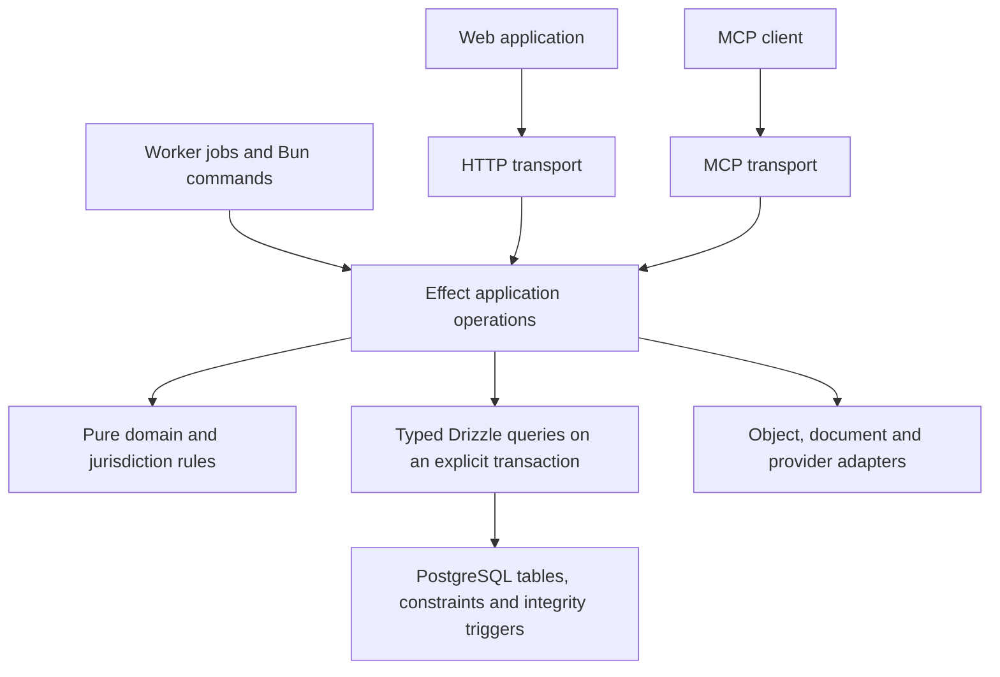

# Application-owned accounting replacement

Status: proposed implementation plan, 2026-09-25. Requested as a one-shot plan; no application, database, or test changes have been made by this planning task.

## Outcome and scope

Move accounting policy, calculations, authorization, and workflows into typed TypeScript modules, orchestrated by Effect. Use PostgreSQL for relational storage, efficient queries, transactions, concurrency control, and a deliberately small integrity layer.

The user confirms that there are no users or real deployed database to preserve. Replace the unreleased implementation directly. There is no production data migration, compatibility period, dual writer, old-digest interpreter, or old-schema upgrade requirement. Build the replacement in coherent internal checkpoints and release one complete application. Disposable development databases are recreated explicitly; the application must never automatically reset a database.

Retain the current product capabilities and financial requirements. Preserve useful contracts for the existing web, HTTP, MCP, job, and CLI callers; change them together when the new model benefits from a change. Existing code is a source of requirements and examples, not an obligation to retain every helper, table, or bug. Unimplemented roadmap features do not become part of this refactor.

Keep the installed Bun, Effect 4, Drizzle Effect PostgreSQL adapter, PostgreSQL, Better Auth, Cloudflare Worker, TanStack Query, and StyleX stack. Do not introduce microservices, an event-sourcing framework, a generic workflow engine, a repository framework, or another migration tool.

This is an ownership and maintainability change. Runtime throughput improvements remain a measured hypothesis.

## Source findings that determine the plan

Inspection started at revision `bb628452196a55ceef7516f76fc3cd6471ae4d91`, with existing uncommitted FX work. A lexical scan saw 186 SQL migration files, 37,709 SQL lines, and 703 distinct declared function names. These are historical source counts, not a live catalog: migrations also rename and replace functions. Reconcile the actual checkout again before implementation.

| Finding | Consequence |
| --- | --- |
| [Capabilities](../../apps/api/src/application/capabilities.ts) mostly bind a name and string parameters to a SQL operation. Some [HTTP handlers](../../apps/api/src/transport/http/routes/accounting.ts) call SQL directly. | Rewire every caller to application operations, including operator-only operations that are absent from MCP. |
| [query.ts](../../apps/api/src/db/query.ts) provides a new database layer inside each `query()` invocation. | Putting several existing calls inside an Effect does not create one transaction. Replace this resource boundary before moving writes. |
| [connection.ts](../../apps/api/src/db/connection.ts) already provides the installed native Effect Drizzle database. [The migrator](../../apps/api/scripts/migrate.ts) already uses `db.transaction((tx) => Effect.gen(...))`. | Reuse the existing driver and transaction support. Runtime behavior still needs proof through workerd and Bun. |
| [schema.ts](../../apps/api/src/db/schema.ts) maps only maintenance tables. | Complete typed mappings for application-owned tables; do not treat the current file as the full database schema. |
| [Authentication](../../apps/api/src/transport/http/auth.ts) returns a bearer/session token and relies on SQL to recheck identity and authority. | Moving posting alone would remove the effective authorization boundary. Port admission and its concurrency behavior first. |
| [VAT preparation](../../apps/api/src/application/vat-returns.ts) already separates database capture, a pure jurisdiction calculator, and persistence. | Extend that useful pattern to other calculations, with explicit snapshot/dependency checks. |
| [Preparation jobs](../../apps/api/src/application/preparation-jobs.ts), maintenance scripts, and [operational controls](../../apps/api/scripts/operations/controls.ts) also depend on SQL functions or table shapes. | HTTP parity alone is insufficient; include background work, self-host composition, provisioning, backup, and recovery. |
| [Existing E2E tests](../../apps/api/tests/README.md) exercise a real Worker and disposable PostgreSQL, but do not cover all browser or domain journeys. Some assertions encode function-only permissions and an old migration filename. | Retain behavioral assertions; replace architectural assertions deliberately when test changes are authorized. A green existing suite cannot establish whole-refactor coverage. |

Concurrent work observed at capture: `apps/api/src/db/statements/commerce-fx.ts`, `apps/api/src/transport/http/routes/commerce-fx.ts`, `packages/contracts/src/commerce-fx.ts`, and the untracked `apps/api/migrations/9180-commerce-fx-partial-settlements.sql`. Preserve and reconcile that work into the commerce/FX slice. Do not reset, overwrite, or silently omit it.

## Chosen architecture



The adapters run outside financial transactions. Shared operations enforce authority regardless of transport. Operator-only operations remain callable only through their authorized surfaces.

| Owner | Responsibility | Boundary |
| --- | --- | --- |
| `packages/domain/src/<area>` | Exact values, models, allowed transitions, plan construction, conservation rules, domain errors. | No SQL, HTTP, environment bindings, clocks, or provider access. Pass time and selected facts explicitly. |
| `jurisdictions/se/src/<area>` | Swedish policy, dated calculation profiles, VAT/accounting treatment, statutory rendering rules. | Pure inputs and outputs; unsupported profiles stay explicit. |
| `packages/contracts` | Commands, responses, shared wire schemas, capability metadata and error mapping. | Imports domain schemas; domain code never imports transport contracts. |
| `apps/api/src/application/<area>` | Use cases, permission checks, snapshots, approval lifecycle, transaction coordination and durable job steps. | Calls domain rules and owned persistence functions; runs Effects only at a runtime boundary. |
| `apps/api/src/db/<area>` | Typed tables and parameterized reads/writes, query result decoding, lock acquisition and efficient aggregates. | Receives the caller's transaction; does not decide tax treatment, approvals, workflow eligibility or business effects. |
| `apps/api/src/adapters` | Better Auth, storage, document engines and external integrations. | No independent accounting policy. |
| `apps/api/migrations` | Authoritative DDL, indexes, grants and the allowed integrity mechanisms below. | No feature workflows, policy calculators, API response builders or domain dispatch. |

Use folders inside existing packages. Introduce a service only for a real dependency or cohesive operation. Ordinary pure functions and typed persistence functions do not need matching interface/factory/layer classes.

Expose named operations such as `prepareJournal`, `approveChange`, `executeChange`, `executeSupplierAcceptance`, and `executeFxSettlement`. Their callers pass a verified principal and a decoded command. A financial operation returns a durable receipt or a typed failure. Shared ledger persistence accepts a validated posting and the existing transaction; domain-specific operations own their register effects. Avoid a universal interpreter that accepts arbitrary table mutations.

### What stays in SQL

Keep primary/foreign keys, composite book-scoped references, unique effect and idempotency identities, indexes, exact amount bounds, efficient joins/aggregates, and ordinary row locking. Keep narrowly named integrity triggers only where declarative constraints cannot express the rule:

- A committed voucher has at least two valid lines and balances exactly.
- Posted vouchers and lines cannot be edited or deleted, and later transactions cannot append lines to an already committed voucher.
- Sealed plans, retained revisions and receipts cannot be rewritten; approval use is unique.

Use an immutable expected line count on each voucher and a deferred integrity trigger that checks actual count, valid line shapes and exact balance at commit. A complete voucher must contain exactly that many lines. Because the voucher count and existing lines cannot be edited or deleted, adding even a balanced pair later fails the count check. Serialize competing changes to the same voucher while checking it, and exercise concurrent insert attempts through the runtime role. This avoids using database transaction IDs or mutable session flags as durable accounting identity. Benchmark the guard with the largest admitted line batch so repeated deferred checks do not become quadratic work accidentally.

These are cross-row checks: do not hide table lookups inside ordinary `CHECK` expressions. Prefer foreign keys and uniqueness where sufficient; use the deferred trigger only for the aggregate invariant. If an integrity trigger needs owner privileges to read or lock protected rows, grant those through a narrowly scoped trigger function with a fixed safe search path and no public execution grant. Keep business authorization out of that function. [PostgreSQL constraint guidance](https://www.postgresql.org/docs/17/ddl-constraints.html)

Store money as exact `numeric` with integrality and magnitude checks before any rounding coercion. A `numeric(38,0)` declaration alone is not lexical or fractional-input validation. Use integer/rational arithmetic in TypeScript and decimal strings at JSON boundaries; never convert financial values or large counters to JavaScript `number`.

A period's posting eligibility, a VAT rule, an invoice calculation, an allocation decision, or an approval permission belongs in application/domain code. Constraints may enforce the resulting row relationships without repeating the decision algorithm.

### Alternatives and trust boundary

| Candidate | Assessment |
| --- | --- |
| Keep all commands in stored functions and reorganize migration files. | Improves navigation but leaves policy and tooling split; does not achieve the requested ownership change. |
| Application operations with direct, scoped table writes and database integrity safeguards. | Selected. Gives one readable domain implementation and retains atomic commits and relational integrity. |
| Move every check to application code and use unconstrained tables. | Rejected. Would discard useful protection against inconsistent references, duplicate effects and damaged posted records. |

The selected design trusts the backend process to authenticate users and authorize business decisions. Runtime credentials may write permitted application tables and could therefore manufacture a balanced business action if the backend is compromised. Database integrity is not proof of human approval. This replaces the previous function-only permission model explicitly. Review this as a security-boundary change even though there is no deployed-data migration.

Use a non-owner runtime role with table/column grants for actual operations; deny DDL, role administration, trigger disabling, `TRUNCATE`, and updates/deletes on immutable records. Keep migration/restore credentials separate. Better Auth retains its official Promise adapter and auth-table permissions; accounting operations use native Effect queries. Do not start a second accounting connection through the auth adapter.

The initial replacement uses application-enforced tenant access and mandatory book predicates, backed by composite scoped foreign keys. It does not add a second authorization engine in RLS. Every persistence operation requires an authorized scope, and cross-book directory/discovery operations have explicit principal-filtered queries. Direct runtime SQL is a trusted backend capability, not an end-user interface. If stronger isolation from a compromised backend becomes a requirement, that requires a separate security design; simply setting a caller-controlled book variable in RLS would not establish it.

## Transaction and failure contract

### Prepare and approve

1. Decode input, authenticate the caller, and authorize the requested capability and scope.
2. Capture authoritative facts plus relevant dependency versions in one consistent, short read transaction. Use a repeatable-read snapshot for multi-query captures.
3. Release the connection, then calculate the proposed effects from those immutable inputs. Downloads, rendering, models and provider calls happen here or in bounded durable job steps.
4. Open a short write transaction, recheck authority and captured versions, and persist the immutable plan and its canonical bytes/digest. Return a stale-plan conflict if the basis changed.
5. Human approval is a separate application operation binding actor, exact plan digest, scope and expiry. Agents cannot approve by selecting another entry point.

Choose one canonicalization implementation for the new baseline. Keep the useful current semantics: UTF-8 bytes, deterministic object-key order, preserved array order, exact decimal strings, explicit version, and rejection of invalid Unicode, duplicate keys and unsupported numbers before sealing. There is no old-record compatibility layer. Expected bytes and hashes must come from independent vectors, not the production helper.

### Execute

Caller shape, expressed as pseudocode rather than a new framework:

```text
executeChange(verifiedPrincipal, decodedCommand)
  acquire one scoped Database
  db.transaction(tx =>
    lock and recheck current credential/session and executor membership
    lock the book; check requested entity/book and writer state
    read the command receipt by book and idempotency key
    if the actor/operation/input fingerprint matches: return saved result
    if the key already means something else: fail with conflict
    load the immutable plan and acquire its remaining locks
    validate dependencies, period, authority, approval, exact effects and capacity
    allocate transactional series and commit counters
    write ledger plus all domain register effects using tx
    record approval consumption, receipt and outbox using tx
    validate the response/receipt shape before leaving the callback
    return receipt
  )
  return success only after commit succeeds
```

All nested persistence calls use `tx`. They cannot call the old `query()`, provide their own database layer, use another runtime, or start independent transactions. Domain refusals remain failed Effects inside the callback so they roll back; convert failures to HTTP/MCP responses outside the transaction.

The commit unit is the existing atomic financial group within one book. A correction's reversal and replacement, or another multi-voucher domain bundle, commits with its register effects and aggregate receipt in that unit. Retain complete-group snapshot boundaries so reports cannot observe half a bundle. A durable run with independently approved groups uses separate group transactions and checkpoints; it is not one long database transaction. Port the grouping already supported by each operation without adding the unimplemented general group roadmap.

Keep one book as the financial atomicity boundary. Use read-committed transactions with a per-book write lock for financial, configuration, and readiness-affecting mutations. Retain that simple serialization initially. Lock authority rows before the book; then relevant period/account rows in stable order, domain resource rows in stable type/ID order, approval and approver authority, and transactional counters. Revocation transactions touch authority only and do not acquire book locks. Whole-firm or cross-book administration must not hold one book while entering another; split independent work or acquire a completely ordered lock set.

Use a locked counter row and `UPDATE ... RETURNING` for voucher numbering and committed book sequence, with an explicit maximum check. Do not replace those counters with `nextval()` or identity columns: PostgreSQL sequence allocation is not rolled back with the financial transaction. Ordinary opaque record IDs do not promise gapless allocation. [PostgreSQL transaction isolation](https://www.postgresql.org/docs/17/transaction-iso.html)

Read current database time after lock waits when checking expiry. Recheck credential/session expiry, identity admission, executor and approver authority inside the mutation transaction. Better Auth verification at the HTTP edge alone is insufficient. The first implementation slice must exercise session deletion, credential revocation and membership changes against execution.

An unchanged idempotent replay is checked before approval-consumed, approval-expired, and dependency-stale checks; it returns the original receipt if the caller still has access. Bind the fingerprint to actor, operation, scope, target IDs and canonical input. Distinct keys still meet unique economic-effect constraints. A rollback leaves no successful receipt or partially consumed approval. Use unique approval-consumption records at the operation's approved effect/group granularity rather than granting arbitrary edits to sealed approvals; consuming one authorized group must not accidentally authorize or invalidate another.

Preserve separate dependency concepts: posting eligibility changes on close/reopen; content/coverage changes on relevant inserts. An ordinary unrelated posting must not stale every independent proposal merely because the book sequence advanced. Aggregate close, VAT and reconciliation plans do depend on their relevant collection contents.

### Errors, interruption and recovery

Domain failures originate as typed TypeScript errors. Map only known constraint identities to documented conflicts or validation failures. Do not retain SQL `P0001` as the normal domain-message channel. Handle both query errors and transaction/commit errors at a sanitized database boundary; retain the current protection against exposing SQL, parameters, credentials or raw causes.

Keep current client-visible distinctions such as unauthorized, forbidden, not found, invalid input, stale dependency, closed period and conflicting idempotency key. Contract changes update web, HTTP and MCP together.

Connection loss, cancellation, timeout, or output failure near commit can leave an uncertain outcome. Recover using the original key and immutable request or a receipt/status read. Do not issue a new economic command or silently retry a potentially committed write. Initially return explicit conflict/unavailable outcomes for lock/deadlock/serialization failures; do not introduce an automatic retry framework in this refactor.

Reads use parameterized queries and explicit response decoding. Single statements use their ordinary snapshot; multi-query reports capture one coherent snapshot. Read committed alone does not make several statements share one snapshot. Reads do not take the financial book write lock unless their accepted semantics require serialization. Preserve bounded pagination and distinguish current views from immutable command receipts.

### PostgreSQL connection and query rules

Use Hyperdrive's existing transaction pooling for the hosted runtime, with query caching disabled. Every explicit transaction remains on one backend connection until completion. Keep Worker clients request-scoped; do not put a live Worker connection in a global singleton. Any Bun pooling must lease a client to the complete transaction and release it through the same scoped lifecycle. Pool and job concurrency must be bounded against the actual database connection budget; raising `max_connections` is not the default scaling mechanism. [Hyperdrive pooling](https://developers.cloudflare.com/hyperdrive/concepts/connection-pooling/)

Configure finite lock, statement, idle-in-transaction and whole-operation deadlines. Preserve the existing connection and statement limits as a starting point, then calibrate shorter financial lock/transaction budgets with the measured workload. Use transaction-local settings where overrides are needed. No session-level tenant context, session advisory locks, or `LISTEN/NOTIFY` dependency is introduced. A timeout around commit still follows the uncertain-outcome contract. [PostgreSQL client settings](https://www.postgresql.org/docs/17/runtime-config-client.html)

Use `FOR UPDATE SKIP LOCKED` only for bounded job/outbox claim batches, followed by a durable lease/fencing token and a short commit. Run the external step after releasing the claim transaction. Do not use `SKIP LOCKED` to skip a contended financial record and report an incomplete accounting operation as successful.

Keep relational identity, money, dates, states and links in typed columns. Use JSONB for sealed plan bodies, input manifests and genuinely structured payloads. Use `date` for accounting dates, `timestamptz` for instants, and explicit nullability/state checks. Preserve opaque ID semantics without a wholesale ID-format rewrite or a dependency on PostgreSQL features newer than the repository's PostgreSQL 17 proof target. Financial references use restrictive deletion rules, not cascading deletion of posted history.

Design indexes with actual queries: scoped keys and foreign-key lookup paths, `(book_id, sequence, id)` or the matching date/ID order for keyset pages, unique book/key and economic-effect indexes, and selective pending-work indexes where useful. PostgreSQL does not automatically index the referencing side of foreign keys. Check existing composite indexes before adding duplicates. Select required columns; batch inputs and inserts; keep filtering, joins and aggregation in SQL instead of loading whole tables into JavaScript. [PostgreSQL constraints and foreign keys](https://www.postgresql.org/docs/17/ddl-constraints.html)

Use representative data and `EXPLAIN (ANALYZE, BUFFERS)` in the disposable environment to assess hot reads and batch writes. `ANALYZE` executes the statement, so never apply it casually to a live mutation. Keep autovacuum enabled; inspect long transactions, lock waits, active/idle connections and dead tuples. Do not add partitioning, replicas, sharding, denormalized balances or broad index sets without a measured need. The postgres skill supplies planning guidance, not evidence that any selected query is fast.

## Domain slices and complete caller coverage

Each row includes preparation, execution, corrections/reversals where currently implemented, reads, recovery, and caller rewiring. The inventory must classify every reachable operation; these groups are ownership boundaries, not new deployments.

| Slice | Source families to account for | Primary target |
| --- | --- | --- |
| Identity and setup | Better Auth/session admission, API credentials, firms/client grants, company setup, books, periods, accounts, dimensions, rule activation. | Application identity/books operations and typed scoped persistence. |
| Posting and corrections | Evidence, change sets, validation, approval, execution, receipts, posting recovery, multi-effect corrections and economic uniqueness. | Domain posting/correction models plus application ledger operations. |
| Evidence and work | Source intake/archive, content versus occurrence identity, parser previews, historical import admission, cases, recurring preparation, review workspace. | Domain evidence/work models; storage and parser adapters remain outside transactions. |
| Sales | CRM parties, catalog, sales orders, recurring sales, invoice drafts, issuance/cancellation, collections, legal sales policy and document/delivery state. | Domain commerce plus jurisdiction policy; application sales operations. |
| Purchases | Supplier inbox/extraction review, draft lines, acceptance, invoice duplicates, partial credits, payment batches and recovery. | Domain purchase calculations and application purchase operations. |
| Banking and settlements | Connector feed state, statements, matching candidates, allocations/reversals, source coverage, reconciliation, inventory/signoff. | Domain bank/settlement rules and application operations. |
| FX | Rate review/withdrawal, original units and carrying value, recognition, partial settlement, corrections and shared capacity claims. | Domain FX plus application commerce/FX coordination in the same posting transaction. |
| Subledgers and owners | Assets/deferrals, schedules, amendments, impairments, disposal, controls, owner register and linked corrections. | Domain schedule/owner calculations and application operations; ledger and schedule effects commit together. |
| VAT and tax account | Expense-tax facts/withdrawals, VAT calculation, drafts/amendments, control reclassification, tax-account imports/matching and claim guards. | Jurisdiction VAT rules and application VAT/tax-account operations. |
| Payroll foundation | Employees, employment/work/opening inputs and existing payroll handoffs. | Domain payroll inputs and application foundation operations; do not invent an unimplemented payroll engine. |
| Reports and closing | Register/ledger reports, comparisons, technical closing/openings, report families, SIE import/export and historical items. | Typed SQL aggregates, pure report/SIE computation and application capture/seal operations. |
| Durable work and operations | Job admission/claim/stop/checkpoints, outbox/delivery, deadlines/calendar feeds, document/PDF capture/render/seal, provisioning, backup/restore controls. | Application jobs and operations with explicit external adapters and bounded claims. |

Cross-module effects compose inside one application-owned transaction. For example, supplier acceptance writes its invoice/register facts and the ledger together; an impairment replaces the appropriate future schedule suffix with its ledger effect; a settlement updates carrying value and capacity with its posting. Do not reduce these to “post a voucher, then update the register.”

Preserve accepted financial meanings from [ADR 0008](../adr/0008-financial-fx-vat-impairment.md), while replacing its implementation ownership. Preserve unsupported-case refusals and actual source limitations. UI success, retained artifacts and provider acceptance remain distinct outcomes.

## Clean database baseline

Use three reviewed baseline migrations: `0001-schema.sql`, `0002-integrity.sql`, and `0003-roles.sql`. They contain the final required schema, small integrity layer, and explicit grants. Keep the current checksum-based runner and one migration receipt ledger. Complete Drizzle table mappings against this authoritative DDL; do not add `drizzle-kit push` or infer the baseline from partial mappings.

During implementation, apply the old chain only to a newly created disposable database when extracting its effective catalog is useful. Capture renamed functions, final constraints, triggers, grants and table relationships; a regex scan cannot identify the final schema. This is a reference inspection, not a migration product or a second runtime path. Verify the new baseline independently against product invariants.

Delete the superseded migration chain, procedural feature functions, SQL dispatch registry and unused function grants once the complete replacement passes. Keep historical code in Git. Update every migration-name reference in scripts, fixtures, manifests, self-host setup and runbooks. The baseline installs on empty databases, reruns without changes, and rejects recorded checksum drift or an incompatible old installation. It never silently drops or rewrites an unexpected database.

After this baseline is released, normal forward migrations apply to future deployed data. No old-to-new populated upgrade is required for this unreleased reset; verification still covers baseline rerun after creating records in the new schema.

## Execution order and gates

One replacement branch and one final cutover; checkpoints provide working slices and reviewable evidence. There are no production feature flags or fallback calls into old stored procedures. Unported source may remain temporarily during construction, but it cannot satisfy completion or ship as a second path.

| Step | Concrete work | Exit condition |
| --- | --- | --- |
| 1. Reconcile scope and authority | Inventory HTTP routes, MCP metadata, direct handlers, Worker jobs, Bun/scripts, domain functions, triggers and grants. Map each to a retained capability, target owner, requirements, failure cases and proof. Include dirty FX work. Write the replacement ADR and reconcile instructions listed below. | Every reachable capability has an owner and every SQL object has a move/retain/delete classification. No unexplained product omissions or conflicting implementation instructions. |
| 2. Establish the transaction and identity foundation | Reuse the installed driver; provide it at operation scope; introduce explicit transaction-passing persistence; port credential/session/membership checks and book admission; implement sanitized query/commit errors and exact codecs. | Workerd and Bun prove one connection per transaction, rollback on failure/interruption, current authority checks, independent book scope, and cleanup. No nested connection acquisition. |
| 3. Deliver the complete posting slice | Build the ledger baseline subset, exact domain posting model, canonical sealing, approval/consumption, counters, receipt and outbox. Rewire prepare/approve/execute/read/recover and ordinary correction through HTTP/MCP/web. | Fresh-book posting, concurrency, uncertain-response recovery and correction pass through the real application; independent observations show one complete effect or none. |
| 4. Port domain slices with their consumers | Complete identity/setup and evidence; sales/purchases; banking/settlements and FX; subledgers/owners; VAT/tax account/payroll foundation; reports/closing. Finish each area's corrections, reads and recovery before marking it done. Reuse existing pure VAT/SIE functions. | Each area passes its inventory's observable financial and access cases, including register/ledger atomicity. No endpoint in a completed area calls procedural business SQL. |
| 5. Complete durable work and operational entry points | Port job leases/fencing, outbox and delivery state, source/document pipelines, calendar feeds, scheduled dispatch, self-host commands and operational controls. Adjust startup/provisioning and backup/restore manifests to the new schema. | Restarted or duplicate jobs converge; stale claims cannot commit; rendering/providers happen outside transactions; Bun and Worker call the same domain operations. Backup and restore of the new baseline preserve observed effects. |
| 6. Finish the baseline and remove superseded paths | Consolidate schema/integrity/grants; remove old migrations, SQL workflow functions, operation-name/string-array dispatch, wrappers, grants, obsolete imports and old authority documentation. Update all internal callers together. | A fresh install contains only the classified integrity functions; catalog and source audits find no business-function calls or duplicate policy implementation. Every inventory row is closed. |
| 7. Run integrated acceptance | Run strict checks, the authorized real E2E lanes, browser journeys, self-host parity and transaction timing/query observations. Retain the evidence packet below. | All applicable financial, security, recovery, runtime and caller criteria pass at the same recorded source revision. Missing or skipped required cases remain incomplete. |

The riskiest dependency is step 2, followed immediately by real posting in step 3. Do not translate every stored procedure before proving the transaction and authorization model. This is a dependency order, not a reduced-scope rollout.

## Failure-first verification contract

Write the observable failure cases and independent expected outcomes before implementation. Reuse the current Vitest/Vite+/Playwright and disposable PostgreSQL setup. Prefer E2E as the sole behavioral test mechanism. Do not add unit tests after writing code, replace the database with mocks, or wrap all requests in an outer test transaction.

The present request authorizes planning only. Existing tests can be run as-is; additions or edits to E2E tests, fixtures and helpers require explicit authorization under `AGENTS.md`. This table defines the proposed test scope without creating those files or claiming that the old authorization covers this redesign.

| Failure to expose | Required observable result |
| --- | --- |
| One posting step uses another connection or commits early. | Inject a late receipt/outbox failure: ledger, register changes, counters, approval use and receipts all roll back. |
| Concurrent first execution posts twice. | Synchronize overlap at actual locks; same key/input produces one receipt/effect; different keys for the same economic effect still cannot duplicate it. |
| A receipt replay is rejected because approval is now consumed/expired. | With current access, identical replay returns the original receipt; changed actor/input conflicts. |
| The response disappears after commit or connection fails around commit. | Original-key recovery converges without another voucher or capacity use; a missing observation never becomes false proof of rollback. |
| Session, credential, membership or approver authority changes during execution. | Defined lock ordering produces an authorized serialization or refusal with no partial effect; no stale edge-authentication bypass. |
| Another entity/book ID, child ID or cursor is substituted. | HTTP, MCP, jobs and reads deny access; scoped foreign keys reject cross-book links. |
| Agent reaches an operator-only operation through another transport. | Shared application authorization rejects it; ordinary MCP exposes no approval capability. |
| Amounts lose precision or malformed decimals are rounded into validity. | Exact results for `9007199254740993`, `10^38 - 1`, oversized aggregates and partial allocations; fractions, numeric JSON money, unsupported scales and overflows reject before posting. |
| Sealed content changes or calculation policy is applied twice. | Approval binds the exact bytes/digest and dependencies; stale plans refuse; SQL contains no competing calculator. |
| Book content and posting eligibility versions are confused. | Unrelated posting does not stale independent work; relevant collection/period/profile changes invalidate affected aggregate work. |
| Ledger and domain register disagree. | AR/AP settlement, partial FX, VAT reclassification, impairment/disposal and correction have independently specified before/after balances, capacities and links, committed atomically. |
| Database grants or integrity rules are too permissive. | Runtime cannot alter/drop schema, truncate tables, edit/delete posted records, append to an old voucher, commit an unbalanced voucher or create cross-book references. Permitted scoped DML succeeds. |
| A counter allocation survives rollback or half a voucher group becomes a report cutoff. | A failed posting leaves counters unchanged; a report accepts only complete committed group boundaries. |
| Locks, claims or leaked connections exhaust the database. | Controlled contention hits the configured deadline, releases resources, and leaves a usable next request; bounded claim batches do not hold locks during external work. |
| Rendering/provider work extends financial locks or retries an external action blindly. | Capture/commit and external work are separate; retained job/output identities support restart and explicit uncertain outcomes. |
| New baseline setup is incomplete. | Fresh setup, populated rerun and checksum-drift rejection work; incompatible old databases fail without modification. Effective grants match the table/column matrix. |
| UI or MCP still uses an obsolete implementation. | Browser prepare → review → approve → execute → reload/recover and real MCP requests reach the new services and show the same independently observed receipt/ledger facts. |
| Local Bun success hides a Worker adapter failure. | Execute the transaction and financial cases in both local workerd and the Bun self-host app; connection cleanup is observed in each. |
| Background replay, cancellation or old claims overwrite newer work. | Bounded jobs survive restart; only the current claim can advance state; committed accounting is undone only by an explicit correction. |
| Aggregate SQL or paging produces inconsistent reports. | A captured cutoff produces stable pages and reconciles to independent ledger/register totals; incomplete coverage is explicit. |

The existing persistence test asserting that the runtime cannot update a book counter encodes the old architecture. Replace that assertion with the new grant/integrity cases when authorized, while preserving its rollback, immutable-history and migration-rerun checks. Do not delete tests merely because they expose a financial regression.

Proposed execution commands from the repository root, once implementation and any required test edits are authorized:

```bash
bun run lint
bun run check-types
bun run format:check
bun run build
bun run test:e2e
```

The existing E2E runner owns a fresh PostgreSQL cluster and does not use ambient database credentials. It writes `test-results/e2e`; preserve each accepted run before another invocation overwrites it. Browser and Bun application lanes need the scoped additions above because the existing suite does not provide them all. Local workerd evidence does not certify managed Hyperdrive networking; exercise that separately only in an authorized environment.

Each accepted run retains a replay command, source revision and dirty-file hashes, lockfile/baseline hashes, runtime/PostgreSQL versions, scenario inputs and independent expected/observed facts, sanitized receipts/ledger/register snapshots, collected/executed case counts, logs, cleanup results, and relevant browser traces/screenshots or exported artifacts. An `acceptance.json` manifest maps each inventory capability and scenario to its evidence and result. Exclude credentials and session tokens.

## Development and runtime scalability checks

The architectural success criteria are observable: one policy implementation per domain rule; typed named operation calls; no string-array SQL command protocol; domain rules readable without tracing successive migrations; one explicit transaction per financial command; and no transport/database imports in pure domain modules.

For runtime performance, record query count, transaction duration, lock-wait duration and end-to-end latency on fixed posting, partial-settlement, report and import workloads. Include same-book contention and independent-book concurrency, with identical inputs, environment and warm-up policy. Set comparison tolerances from that baseline before judging the replacement. Batch line inserts and set-based reads; index actual predicates; avoid per-line round trips. Do not claim higher throughput solely because logic moved to TypeScript. Change the per-book lock design only if measurements justify the additional concurrency model.

## Documentation and cleanup ownership

At implementation start, record the selected boundary in a new ADR and update these authorities together:

- `AGENTS.md`, `apps/api/README.md`, and `.agents/skills/effect-ts/references/database-access.md` / `business-operations.md`: replace function-only write rules with application transactions and the defined integrity boundary.
- `docs/architecture.md`, `docs/architecture-followup.md`, `docs/domain.md`, and `docs/plans/00-shared-contracts.md`: transaction, authorization, dependency and module ownership.
- ADRs 0001/0002/0004/0007/0008: mark the superseded implementation/compatibility portions and link the new decision; retain valid financial requirements and historical context.
- `docs/plans/README.md`, delivery/acceptance plans, `docs/open-decisions.md`, `docs/roadmap.md`, local development, verification and self-host/operations documentation: remove old-schema preservation gates for this reset; describe the new baseline and retain real company/provider applicability gates.
- `apps/api/tests/README.md` and affected tests/fixtures/manifests, when authorized: correct permission/migration assumptions and name actual coverage limitations.

This planning task leaves current implementation instructions intact. Its proposed boundary supersedes them only as part of the authorized implementation change; it does not represent the current code as already migrated.

## Completion and limitations

Completion requires all inventory capabilities and internal callers to use application-owned behavior; one clean install path; no procedural business SQL or fallback dispatch; no lost domain effects; passing authorized financial/access/recovery evidence; and consistent instructions/docs. The SQL allowlist is justified by integrity responsibility, not an arbitrary line-count target.

Source inspection establishes the current coupling and available transaction API. This task has not executed the application, proved the new trust boundary, benchmarked either design, or validated any company's accounting. The plan can be implemented without company production data or provider credentials; synthetic correctness and external/company acceptance remain separate claims.

Platform references: [PostgreSQL transactions](https://www.postgresql.org/docs/current/tutorial-transactions.html) explain multi-statement atomicity. [PostgreSQL row security](https://www.postgresql.org/docs/current/ddl-rowsecurity.html) explains its distinct protection and role-bypass limits. [Hyperdrive connection pooling](https://developers.cloudflare.com/hyperdrive/concepts/connection-pooling/) informs transaction/connection scoping; it does not substitute for exercising the installed adapter.
