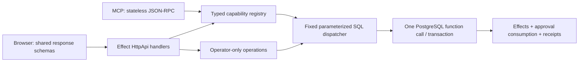

# FND-01: implementation and contract reconciliation

Status: reconciliation completed for checkpoint `90db69b454c8a3aa4509d75e8a57b185c27ae5d7` on 2026-09-22. This closes the source/contract inventory and upgrade-design packet, not FND-02/FND-03/FND-04 or the posting release gate. The [machine inventory](evidence/fnd01-inventory.json) binds observations to source hashes, generated contracts and latest SQL definitions. [Verification evidence](evidence/fnd01-verification.json) records actual commands and limits.

The main checkout changed during this task, including a database-adapter migration and commerce UI work. Verification therefore uses an isolated checkout of the checkpoint above. Those concurrent changes need a fresh compatibility/evidence comparison; they are not certified by these results. Earlier domain handoff notes sometimes say “add this handler” even though the checkpoint has already integrated it. Executable composition and the pinned source take precedence over those historical instructions.

The inventory also records a separate live-delta observation at handoff. At that observation, shared contract schemas and applied SQL migration files still matched the pinned source; the adapter, maintenance scripts, dependencies and commerce UI were changing. This narrows the next comparison without assigning old runtime results to the new adapter.

## Outcome and retained decisions

The foundation already has one shared operation path, exact posted amounts, database transaction ownership, command receipts, correction bundles and several synthetic domain modules. Keep these implementations and complete their missing contracts/proof. No money-format replacement, route renaming, rehashing of approved plans or rewrite of applied migrations is needed for FND-01. Current repository instructions now select Drizzle's Effect adapter; that concurrent migration must preserve the pinned behavior and receive its own runtime evidence.

Four points needed reconciliation with the plan:

1. **Lock order:** migration 0210 locks the credential and executor membership before a public mutation takes the book barrier. Retain that admission prefix and authority-only revocation transactions. Adding the previously proposed book-first membership updater would reverse the existing order. FND-02 owns new permission/membership operations and concurrency proof.
2. **Existing error semantics:** `ApprovalRequired` is HTTP 403. Preserve it and the CamelCase code family. Planned snapshot-boundary failure is `InvalidSnapshotBoundary`; it is not installed yet. New recovery metadata must extend supported clients without silently changing current error meanings.
3. **Snapshot scope:** current trial-balance preparation acquires the book barrier and chooses its current committed sequence internally. It does not accept an arbitrary historical cutoff. General group-boundary storage/refusal is a planned extension, not evidence that the current trial balance exposes half a committed correction.
4. **Counter versus money limits:** monetary inputs support 38 digits; voucher/commit counters are PostgreSQL `bigint`. A common string codec does not make their storage limits identical. Keep exact amount bounds and define counter exhaustion separately.

These choices are reflected in [shared contracts](00-shared-contracts.md), the posting/report plans and [ADR 0004](../adr/0004-complete-accounting-delivery-contract.md).

## Actual operation path

At the checkpoint, the adapter is `pg.Client` with Effect-scoped acquisition/disposal. A named SQL function owns the transaction through the statement's implicit PostgreSQL transaction; the application does not orchestrate a sequence of independent financial writes. Core and synthetic domain preparation currently live substantially in SQL. This is compatible with preserving small existing deterministic preparations, while the plan assigns future complex rule calculations one explicit domain owner. The new adapter being developed elsewhere must preserve this transaction/error/resource boundary.

The generated API contains **81 REST operations**, comprising 77 accounting/database operations plus two system and two session operations. **69 MCP capabilities** are declared and bound. All 77 dispatcher functions have a corresponding declared runtime grant; every REST operation has a handler; no declared capability is unbound. These are source/registration checks, not 81 verified workflows. The detailed operation rows include method/path, schema fingerprint, handler, capability, SQL operation and final defining migration.

| Family                | REST operations | Actual caller and bounded behavior                                                                                                                                              | Next packet          |
| --------------------- | --------------: | ------------------------------------------------------------------------------------------------------------------------------------------------------------------------------- | -------------------- |
| System/session        |               4 | Health/status; manually provisioned bearer token exchanged for same-origin cookie. No production OIDC flow.                                                                     | FND-02               |
| Accounting            |              15 | Journal/evidence/review/receipt/ledger UI; exact single-action synthetic posting and reversal.                                                                                  | PST-01–PST-04        |
| Posting recovery      |               3 | Dedicated recovery list/review; receipt discovery and timed absence, including colleague-readable history.                                                                      | PST-03/PST-04        |
| Corrections           |               5 | Bundle UI/REST/MCP, operator-only approval, paired original/reversal/replacement receipt history.                                                                               | COR-01/COR-02        |
| Bank reconciliation   |               5 | Normalized synthetic statement admission, original exact matches and reconciliation UI.                                                                                         | IMP-01/IMP-02/IMP-05 |
| Bank allocations      |               6 | Reviewed signed partial/many-to-many capacity and reconciliation UI; separate from commerce capacity.                                                                           | IMP-04               |
| Commerce              |              14 | REST/MCP registration of invoices against existing posted recognition lines; approved allocations against posted payment control lines. Dedicated UI absent at this checkpoint. | COM-01–COM-06        |
| Subledgers            |               5 | Schedule UI, exact synthetic equal allocation and occurrence preparation through the kernel.                                                                                    | AST-01–AST-03        |
| Closing               |               8 | Inventory/readiness, technical lock/reopen approval, history and certificates. Financial close/statutory support absent.                                                        | END-01/END-02        |
| Reports               |               4 | Stored trial-balance snapshot, paged lines and contribution explanations; coverage explicitly not established.                                                                  | END-03               |
| Cases                 |               3 | Frozen case context and scoped evidence/plan/receipt links.                                                                                                                     | FND-03/PST-04        |
| Recurring preparation |               9 | Propose/simulate rules, operator activation/deactivation, bounded durable preparation runs; no automatic posting mandate.                                                       | PST-05               |

The eight accounting operations deliberately absent from MCP are journal approval, recurring activation/deactivation, correction approval, bank-allocation approval, commerce-allocation approval, closing-inventory declaration and closing approval. Source names and grants are enumerated in the inventory. No ordinary approval/activation tool appears in the MCP catalogue.

MCP supports the declared `2025-11-25` and `2025-06-18` protocol versions, POST-only stateless JSON responses, and actual database authentication before discovery. It does not implement SSE, subscriptions or background-task protocol. Its 202 notification acknowledgment is transport behavior, not admission of a durable accounting job.

## Money, canonicalization and immutable identity

| Boundary         | Observed implementation                                                                                                                                                                                | Compatibility rule and remaining work                                                                                                                                                                   |
| ---------------- | ------------------------------------------------------------------------------------------------------------------------------------------------------------------------------------------------------ | ------------------------------------------------------------------------------------------------------------------------------------------------------------------------------------------------------- |
| Posted line      | `MinorUnits` is a canonical string below `10^38`; SQL numeric domain rejects fractions/negative/out-of-bound values, and line constraint requires exactly one positive side.                           | Keep paired `debitMinor`/`creditMinor`; large exact amount has existing E2E coverage. Further decimal/rate types belong to FND-03/domain packets.                                                       |
| Aggregates       | Separate unbounded signed/nonnegative string codecs; SQL uses exact numeric sums.                                                                                                                      | Do not narrow aggregates to line bounds or JavaScript number. Resource bounds still apply to requests/calculations.                                                                                     |
| Sealed journal   | Version 1; `openerp-c14n-v1`; stored plan minus `planDigest` is canonicalized and hashed. Includes generated identities, creation time, effects and dependency rows.                                   | Repeated equivalent preparation can have a different digest because identity/time differ. Idempotency replays retained bytes; it is not semantic deduplication by plan hash.                            |
| Canonical bytes  | Recursive JSON object keys ordered with `COLLATE "C"`; arrays preserve order; scalar spelling comes from PostgreSQL `jsonb::text`; SHA-256 over UTF-8.                                                 | SQL is the existing v1 authority. Do not substitute `JSON.stringify` or a presumed standard canonicalizer. Cross-runtime vectors and stricter raw JSON admission remain D-03/PST-01.                    |
| Source identity  | Evidence uniqueness is `(book, sha256)`; journal event identity is `(book, evidence, eventKey)`.                                                                                                       | This identifies stored content/components, not all economic events across different documents. IMP-01 adds acquisition/occurrence and reviewed economic links without inventing old missing provenance. |
| Command identity | One `(book,key)` namespace; fingerprint binds operation, actor and input including target IDs; immutable response retained.                                                                            | Preserve names/fingerprint interpretation and same-actor replay. Receipt access can remain available to a currently authorized colleague.                                                               |
| Correction       | Bundle digest and approval bind both sealed children. One SQL transaction invokes both child postings and writes the aggregate receipt; deferred constraint requires complete bundle receipt/children. | Keep the constraint. Standalone child execution cannot commit; hiding it in recovery is only a UI guard. Complete failure/concurrency proof remains COR-01/COR-02.                                      |

Admission uses normal JSON parsing before Effect decoding. It does not independently reject duplicate object keys before that parse. The current dates schema validates spelling; semantic calendar checks live in SQL. Broader public-admission guarantees in the plan must be implemented and exercised rather than inferred from the presence of shared schemas.

## Concrete gaps and owners

| Gap                                         | Observed consequence                                                                                                                                                                                               | Owner / decisive next result                                                                                                             |
| ------------------------------------------- | ------------------------------------------------------------------------------------------------------------------------------------------------------------------------------------------------------------------ | ---------------------------------------------------------------------------------------------------------------------------------------- |
| Production identity and fine-grained powers | Operator/agent membership and expiring hash-stored tokens exist; OIDC, production session lifecycle and separate financial powers do not.                                                                          | FND-02: issuer/role contract, trusted admission, revocation and restricted-role proof.                                                   |
| Approval revocation                         | Credentials can be revoked and current approver membership is checked; there is no explicit plan-approval revocation operation/event. Approval duration is currently fixed at one hour.                            | PST-02: append-only approval revocation, explicit expiry policy, all owning workflows and races.                                         |
| Raw JSON/canonicalization proof             | No independent v1 vectors or duplicate-key admission boundary.                                                                                                                                                     | PST-01/D-03: preserve old digests; reject ambiguous new input and record exact vectors.                                                  |
| Generated authentication documentation      | OpenAPI operations declare empty security arrays although runtime handlers authenticate. This is documentation/schema drift, not proof of an unauthenticated runtime path.                                         | FND-02/PST-04: annotate actual bearer/cookie requirements and operator restrictions; verify generated clients.                           |
| Capability discovery lags integration       | Latest `get_book_status` lists five earlier feature families; recovery/corrections/partial capacity/commerce/schedules/technical close are not all represented. MCP introduction also describes the earlier scope. | PST-04: derive honest installed/profile/proof states for integrated handlers; retain production-ready false.                             |
| Recovery of preparation identity            | Approval/execution review persists request identity; ordinary journal preparation still keeps its key map in mounted state. Failed/in-flight attempts have no durable request history.                             | PST-03: preserve prepared work and uncertainty semantics across lost preparation response/reload; never infer cancellation from absence. |
| General multi-group execution               | Outbox rows and preparation runs exist; no posting-run admission/lease/fenced delivery worker or general group-boundary registry.                                                                                  | PST-05/OPS-03: transactional run/receipt progress, fences, timeout and unknown-outcome cases.                                            |
| Complete source history                     | Normalized bank rows and text evidence exist; provider/SIE interpretation, occurrence archive and full historical import are not implemented.                                                                      | IMP-01–IMP-03: source inventory, explicit adapters and resumable bounded jobs.                                                           |
| Stable collection snapshots                 | Several lists use live keyset paging; immutable report/case snapshots are a narrower facility.                                                                                                                     | PST-04/END-03: state live versus frozen semantics explicitly; add snapshot-bound cursors where totals/readiness depend on completeness.  |
| Commerce depth                              | Current registration consumes existing recognition/payment lines. It does not issue invoices, calculate tax/discount lines, originate payments, handle cash-method recognition, credits, FX or advances.           | COM packets and relevant VAT/FX profiles; retain distinct bank and invoice capacities.                                                   |
| Register-aware corrections                  | Commerce guards against generic reversals that would invalidate its references; this safe refusal is not a complete credit/payment correction workflow.                                                            | COR-03/COM-04/AST-03: atomic domain consequences and control reconciliation.                                                             |
| Schedule amendments and real treatments     | Prepared schedules are frozen; exact equal allocation alone is not legal depreciation. Payroll, VAT and FX remain unsupported.                                                                                     | AST and other P4/P5 packets with reviewed rules/company facts.                                                                           |
| Financial close and statutory output        | Technical certificate and trial balance do not implement OpeningSet, tax bridge, statements, disclosures or filing.                                                                                                | END-02–END-07; preserve technical/statutory status separation.                                                                           |
| Archive and production operations           | Synthetic local backup/restore CLI exists; full object/key/privilege recovery, provider-attempt reconciliation and enforced writer transfer are not proved.                                                        | OPS packets and D-07/D-10.                                                                                                               |

These are scoped missing capabilities or proof gaps. They are not evidence that the complete future plan is already implemented. In particular, balanced SQL entries and a passing core suite cannot establish VAT, payroll, full-year close or actual-company parity.

## Verification observed in this packet

The isolated checkout was clean at the pinned revision. `bun run check-types`, `bun run lint` and `bun run format:check` passed. The unchanged `bun run test:e2e` suite ran against local workerd and a fresh PostgreSQL 17.11 cluster under Node 22.23.2: **19 passed, 1 failed**. Passing cases cover selected exact-money, admission, repeated/concurrent execution, reversal, late rollback, restricted-role denial, migration-rerun/checksum and MCP behaviors. They do not prove every scenario assigned to those families.

The browser launched with the pinned Chromium headless runtime, but the saved screen shows sign-in refused with **Forbidden**. Its `finally` block then called `tracing.stop` before tracing had started, masking the earlier failure and skipping its remaining cleanup. This is a failed browser result, not a test skipped for missing Chromium. Session source points to the same-origin admission guard; an exact dev-proxy origin diagnosis still needs an instrumented reproduction. The existing failure artifact is the starting observation for FND-02/PST-04, and the cleanup defect belongs to the FND-04 harness work. Do not weaken origin checks to make the test pass.

The task stopped only the verified dev-server process from that failed run. The PostgreSQL/Worker harness performed its own cleanup. Earlier results were preserved before the first shared-checkout run. Raw results, manifest, screenshot and logs are hash-indexed in [verification evidence](evidence/fnd01-verification.json); they remain local artifacts, not a production or compliance certification. No new or modified test definition was needed for this observation.

## Applied migration and populated-upgrade contract

The checkpoint has 25 SQL migrations from 0001 through 0800. The runner hashes each file, locks the migration receipt table, applies one file and its receipt in one transaction, refuses a changed recorded checksum, and supports an explicit last-reviewed filename. The pinned inventory lists every checksum and effective function definition. Later `CREATE OR REPLACE` definitions supersede earlier source versions; auditing only 0001 would misstate current admission, ledger and correction behavior.

Migration-owner defaults revoke global PUBLIC function execution from 0006 onward. Runtime functions are explicitly granted; private helpers and tables are not generally granted to `openerp_runtime`. The default-privilege rule belongs to the creating role, so changing migration owner requires re-establishing and checking it. The application login must inherit only its intended runtime role and must not be an owner, superuser or bypass role. The current E2E tests exercise selected bypass attempts; exhaustive effective grants remain FND-02/FND-04 work.

For the next populated upgrade:

1. Select a supported source checkpoint and immutable migration prefix. Capture its actual migration receipts, code/configuration/role versions, book/counter boundaries and source/plan/approval/receipt/control manifests. Use a permitted disposable copy for rehearsal.
2. Reconstruct that older prefix and populate it through its public operations before applying the new migrations. Keep at least unexecuted and approved plans, committed/replayed posting, original reversal and correction bundle, evidence/event identities, bank relationships, register/schedule state, report snapshots and a technical lock where that source prefix supports them. Unsupported families enter at a later supported checkpoint; do not pretend an early schema contained them.
3. Revoke default PUBLIC access under the actual migration owner; apply only new forward migrations using the existing runner. New foundation changes receive an unused approved sequence after the applied dependency prefix. Coordinate domain ranges before assigning a number; never edit 0210, 0300 or 0400 to implement these findings.
4. Compare original evidence bytes/hashes, sealed canonical digests, voucher/line/receipt identities, current balances, approvals and history before/after. Backfilled metadata must be derivable from retained facts; unknown historical source occurrences remain unknown. Never regenerate timestamps/IDs or rehash approved plans to make an upgrade pass.
5. Exercise reads/replay with existing request schemas and actual restricted credentials; exercise the new path and final grants. Re-run the migrator to verify no state changes. A new feature is advertised only after its handlers, compatibility and constraints are installed together.
6. Record upgrade duration, failures, forward-recovery procedure and whether the prior application can still read/use the new schema. Rehearse recovery without erasing acknowledged effects. A failed per-file migration rolls that file back; an earlier committed migration is not undone automatically.

The existing migration E2E checks a **rerun on an already-current populated database**, plus checksum refusal. That is useful evidence but is not an old-populated-schema-to-new-schema upgrade test. The steps above are the explicit FND-04 acceptance input for that remaining proof.

## Handoff and next ready work

FND-01 is complete as a reconciled baseline and compatibility/upgrade decision record. No product code, applied migration or test definition was changed by this packet. Its observed checks are linked separately so a later adapter change cannot inherit their pass implicitly.

The next engineering frontier is FND-02/FND-03/FND-04: trusted admission and effective permissions; versioned company/rule/source coverage; and fixed-revision fault/runtime/populated-upgrade evidence. Prioritize the observed browser sign-in failure and reliable harness cleanup before claiming all-channel posting. PST-01 can then complete sealed-plan admission against the shared inputs. Inspect the concurrent adapter/UI diff first and compare it with this baseline; reuse implementation that satisfies the packet and preserve the existing external contract.
